# Data Enrichment

This document provides a comprehensive guide to implementing and using data enrichment providers in the `lib-common-data` library.

## Table of Contents

- [How It Works](#how-it-works)
- [Overview](#overview)
- [Architecture](#architecture)
- [Core Concepts](#core-concepts)
- [Quick Start](#quick-start)
- [Tutorial: Building a Professional Data Enricher](#tutorial-building-a-professional-data-enricher)
- [Implementation Guide](#implementation-guide)
- [Provider-Specific Operations](#provider-specific-operations)
- [Enricher Utilities](#enricher-utilities)
- [Configuration](#configuration)
- [Examples](#examples)
- [Best Practices](#best-practices)

---

## How It Works

### The Complete Enrichment Flow

Data enrichment combines your partial data with complete data from third-party providers. Here's the complete flow:

```
┌─────────────────────────────────────────────────────────────────────────┐
│ 1. CLIENT DISCOVERS AVAILABLE PROVIDERS (Optional)                      │
│                                                                         │
│    GET /api/v1/enrichment/providers?enrichmentType=company-profile      │
│                                                                         │
│    Response: [                                                          │
│      {                                                                  │
│        providerName: "Provider A Spain",                                │
│        supportedTypes: ["company-profile", "credit-report"],            │
│        description: "Provider A Spain data enrichment services",        │
│        endpoints: [                                                     │
│          "/api/v1/enrichment/provider-a-spain-company/enrich",          │
│          "/api/v1/enrichment/provider-a-spain-credit/enrich"            │
│        ],                                                               │
│        operations: [                                                    │
│          {                                                              │
│            operationId: "search-company",                               │
│            path: "/api/v1/enrichment/provider-a-spain/search-company",  │
│            method: "GET",                                               │
│            description: "Search for company to get internal ID"         │
│          }                                                              │
│        ]                                                                │
│      }                                                                  │
│    ]                                                                    │
└─────────────────────────────────────────────────────────────────────────┘
                                    │
                                    ▼
┌─────────────────────────────────────────────────────────────────────────┐
│ 2. CLIENT SENDS HTTP REQUEST TO SPECIFIC PROVIDER ENDPOINT              │
│                                                                         │
│    POST /api/v1/enrichment/provider-a-spain-company/enrich              │
│         ─────────────────────────────────────────                       │
│         Provider + Region + Type in URL path                            │
│                                                                         │
│    EnrichmentRequest {                                                  │
│      enrichmentType: "company-profile"  ← For logging/metadata          │
│      sourceDto: {                       ← Your partial data             │
│        companyId: "12345",                                              │
│        name: "Acme Corp"                                                │
│      },                                                                 │
│      parameters: {                      ← Provider-specific params      │
│        companyId: "12345"                                               │
│      },                                                                 │
│      strategy: ENHANCE                  ← How to merge data             │
│    }                                                                    │
└─────────────────────────────────────────────────────────────────────────┘
                                    │
                                    ▼
┌─────────────────────────────────────────────────────────────────────────┐
│ 3. CONTROLLER RECEIVES REQUEST                                          │
│                                                                         │
│    ProviderASpainCompanyController                                      │
│      → Already knows which enricher to use (injected in constructor)    │
│      → No routing logic needed - one controller per enricher            │
│      → Calls: enricher.enrich(request)                                  │
└─────────────────────────────────────────────────────────────────────────┘
                                    │
                                    ▼
┌─────────────────────────────────────────────────────────────────────────┐
│ 4. ENRICHER FETCHES PROVIDER DATA                                       │
│                                                                         │
│    ProviderASpainCompanyEnricher.fetchProviderData(request)             │
│      → Calls Provider A Spain API                                       │
│      → Returns: ProviderACompanyResponse {                              │
│           id: "12345",                                                  │
│           businessName: "Acme Corporation",                             │
│           primaryAddress: "123 Main St",                                │
│           sector: "Technology",                                         │
│           totalEmployees: 500,                                          │
│           revenue: 50000000.0                                           │
│         }                                                               │
└─────────────────────────────────────────────────────────────────────────┘
                                    │
                                    ▼
┌─────────────────────────────────────────────────────────────────────────┐
│ 5. ENRICHER MAPS TO TARGET DTO                                          │
│                                                                         │
│    mapToTarget(providerData)                                            │
│      → Converts Provider A format to your DTO format                    │
│      → Returns: CompanyProfileDTO {                                     │
│           companyId: "12345",                                           │
│           name: "Acme Corporation",                                     │
│           registeredAddress: "123 Main St",                             │
│           industry: "Technology",                                       │
│           employeeCount: 500,                                           │
│           annualRevenue: 50000000.0                                     │
│         }                                                               │
└─────────────────────────────────────────────────────────────────────────┘
                                    │
                                    ▼
┌─────────────────────────────────────────────────────────────────────────┐
│ 6. STRATEGY IS APPLIED AUTOMATICALLY                                    │
│                                                                         │
│    EnrichmentStrategyApplier.apply(ENHANCE, sourceDto, mappedData)      │
│                                                                         │
│    SOURCE (what you had):        MAPPED (from provider):                │
│    {                             {                                      │
│      companyId: "12345",           companyId: "12345",                  │
│      name: "Acme Corp"             name: "Acme Corporation",            │
│    }                               registeredAddress: "123 Main St",    │
│                                    industry: "Technology",              │
│                                    employeeCount: 500,                  │
│                                    annualRevenue: 50000000.0            │
│                                  }                                      │
│                                                                         │
│    ENHANCE Strategy:                                                    │
│    - Keeps source.name ("Acme Corp")  ← Preserves existing data         │
│    - Adds all null fields from mapped data                              │
│                                                                         │
│    RESULT (enrichedDto):                                                │
│    {                                                                    │
│      companyId: "12345",                                                │
│      name: "Acme Corp",              ← From source (preserved)          │
│      registeredAddress: "123 Main St", ← From provider (added)          │
│      industry: "Technology",           ← From provider (added)          │
│      employeeCount: 500,               ← From provider (added)          │
│      annualRevenue: 50000000.0         ← From provider (added)          │
│    }                                                                    │
└─────────────────────────────────────────────────────────────────────────┘
                                    │
                                    ▼
┌─────────────────────────────────────────────────────────────────────────┐
│ 7. RESPONSE IS BUILT WITH METADATA                                      │
│                                                                         │
│    EnrichmentResponse {                                                 │
│      success: true,                                                     │
│      data: enrichedDto,                                                 │
│      providerName: "Provider A Spain",                                  │
│      enrichmentType: "company-profile",                                 │
│      strategy: "ENHANCE",                                               │
│      fieldsEnriched: 4,              ← Auto-counted                     │
│      message: "company-profile enrichment completed successfully"       │
│    }                                                                    │
└─────────────────────────────────────────────────────────────────────────┘
```

### Key Concepts Explained

| Concept | Purpose | Example |
|---------|---------|---------|
| **Microservice** | One microservice per provider (e.g., `core-data-provider-a-enricher`) | Contains all Provider A enrichers for different regions/products |
| **Enricher** | One enricher per provider-region-product combination | `ProviderASpainCompanyEnricher`, `ProviderAUSACreditEnricher` |
| **Controller** | One controller per enricher with dedicated endpoint | `ProviderASpainCompanyController` → `/api/v1/enrichment/provider-a-spain-company/enrich` |
| **enrichmentType** | Identifies the type of enrichment (for logging/metadata and discovery filtering) | `"company-profile"`, `"credit-report"` |
| **sourceDto** | Your partial/incomplete data | `{ companyId: "12345", name: "Acme Corp" }` |
| **parameters** | Provider-specific parameters for the API call | `{ companyId: "12345", includeFinancials: true }` |
| **providerData** | Raw response from third-party API | `ProviderACompanyResponse` from Provider A API |
| **mappedData** | Provider data converted to your DTO format | `CompanyProfileDTO` with provider data |
| **strategy** | How to merge sourceDto + mappedData | `ENHANCE`, `MERGE`, `REPLACE`, `RAW` |
| **enrichedDto** | Final result after applying strategy | `CompanyProfileDTO` with merged data |
| **getSupportedEnrichmentTypes()** | Declares which types this enricher handles (used by discovery endpoint for filtering) | `["company-profile", "company-financials"]` |
| **getEnrichmentEndpoint()** | Returns the REST API endpoint for this enricher (automatically registered by controller) | `"/api/v1/enrichment/provider-a-spain-company/enrich"` |

**Important Architecture Points:**

1. **Routing by URL Path**: Each enricher has its own dedicated REST endpoint (e.g., `/api/v1/enrichment/provider-a-spain-credit/enrich`). The URL path determines which enricher is used - no routing logic needed.

2. **enrichmentType Field**: Used for logging, metadata, and filtering in the discovery endpoint - NOT for routing.

3. **Provider Discovery**: To discover available providers in a microservice, use the global discovery endpoint:
   ```bash
   GET /api/v1/enrichment/providers                           # List all providers in this microservice
   GET /api/v1/enrichment/providers?enrichmentType=credit-report  # Filter by type
   ```

   Response includes provider names, supported types, descriptions, and **REST endpoints**:
   ```json
   [
     {
       "providerName": "Provider A Spain",
       "supportedTypes": ["company-profile", "credit-report"],
       "description": "Provider A Spain data enrichment services",
       "endpoints": [
         "/api/v1/enrichment/provider-a-spain-company/enrich",
         "/api/v1/enrichment/provider-a-spain-credit/enrich"
       ]
     }
   ]
   ```

### Enrichment Strategies

Each strategy determines how the framework merges your source data with provider data:

| Strategy | Source DTO | Calls `mapToTarget()`? | Return Type | Behavior | Use Case |
|----------|------------|------------------------|-------------|----------|----------|
| **ENHANCE** | ✅ Used | ✅ YES | Your DTO | Fills only null/empty fields. Preserves existing source data. | Fill gaps without overwriting |
| **MERGE** | ✅ Used | ✅ YES | Your DTO | Combines source + provider. Provider wins conflicts. | Update stale data with fresh provider data |
| **REPLACE** | ❌ Ignored | ✅ YES | Your DTO | Uses only provider data. **Transforms** to your DTO format. | Fresh data in **your format** |
| **RAW** | ❌ Ignored | ❌ NO | Provider's format | Returns provider data as-is. **No transformation**. | Fresh data in **provider's format** |

**🔑 Key Difference - REPLACE vs RAW:**
- **REPLACE**: Ignores source, **transforms** provider data → returns `CompanyDTO` with field mapping (`businessName` → `name`)
- **RAW**: Ignores source, **no transformation** → returns `Map<String, Object>` with original field names (`businessName`)

---

## Overview

The Data Enrichment abstraction provides a standardized way to integrate third-party data enrichment providers into your microservices. It supports multiple provider types and enrichment strategies while providing automatic observability, resiliency, and event publishing.

### Key Features

- **Multiple Provider Support**: Financial data providers, credit bureaus, business intelligence, and custom providers
- **Flexible Enrichment Strategies**: ENHANCE, MERGE, REPLACE, and RAW
- **ServiceClient Integration**: Use REST, SOAP, or gRPC clients from lib-common-client
- **Automatic Observability**: Built-in tracing, metrics, and event publishing
- **Resiliency Patterns**: Circuit breaker, retry, rate limiting, and bulkhead
- **Tenant-Aware**: Multi-tenant support for provider routing
- **Registry Pattern**: Auto-discovery and lookup of enrichers

### Use Cases

- Enriching company profiles with financial and corporate data
- Obtaining credit reports for individuals or companies
- Validating and standardizing addresses
- Enriching director/officer information
- Verifying business identities

---

## Architecture

The Data Enrichment abstraction follows the same architectural patterns as DataJobs:

```
┌─────────────────────────────────────────────────────────┐
│                  Application Layer                      │
│  ┌────────────────────────────────────────────┐         │
│  │  Microservice Business Logic               │         │
│  └────────────┬───────────────────────────────┘         │
│               │                                         │
│               ▼                                         │
│  ┌────────────────────────────────────────────┐         │
│  │  DataEnricher Interface                    │         │
│  │  - enrich(request)                         │         │
│  │  - getProviderName()                       │         │
│  │  - getSupportedEnrichmentTypes()           │         │
│  └────────────┬───────────────────────────────┘         │
│               │                                         │
│               ▼                                         │
│  ┌────────────────────────────────────────────┐         │
│  │  TypedDataEnricher<TSource,TProvider,      │         │
│  │                    TTarget>                │         │
│  │  - Observability (tracing, metrics)        │         │
│  │  - Resiliency (circuit breaker, retry)     │         │
│  │  - Event Publishing                        │         │
│  │  - Automatic Strategy Application          │         │
│  │  - Automatic Response Building             │         │
│  └────────────┬───────────────────────────────┘         │
│               │                                         │
│               ▼                                         │
│  ┌────────────────────────────────────────────┐         │
│  │  Your Implementation                       │         │
│  │  - fetchProviderData()                     │         │
│  │  - mapToTarget()                           │         │
│  └────────────┬───────────────────────────────┘         │
└───────────────┼─────────────────────────────────────────┘
                │
                ▼
┌─────────────────────────────────────────────────────────┐
│         Third-Party Providers                           │
│  ┌──────────┐  ┌──────────┐  ┌──────────┐               │
│  │Financial │  │  Credit  │  │ Custom   │               │
│  │   Data   │  │  Bureau  │  │ Provider │               │
│  └──────────┘  └──────────┘  └──────────┘               │
└─────────────────────────────────────────────────────────┘
```

### Microservice Architecture

In a typical deployment, you have **one microservice per provider**, with multiple enricher implementations for different regions and products:

```
┌────────────────────────────────────────────────────────────────────────────┐
│  Microservice: core-data-provider-a-enricher                               │
│                                                                            │
│  ┌─────────────────────────────────────────────────────────────────────┐   │
│  │  ProviderASpainCreditReportEnricher                                 │   │
│  │  - providerName: "Provider A Spain"                                 │   │
│  │  - supportedTypes: ["credit-report", "credit-score"]                │   │
│  │  - endpoint: POST /api/v1/enrichment/provider-a-spain-credit/enrich │   │
│  └─────────────────────────────────────────────────────────────────────┘   │
│                                                                            │
│  ┌─────────────────────────────────────────────────────────────────────┐   │
│  │  ProviderAUSACreditReportEnricher                                   │   │
│  │  - providerName: "Provider A USA"                                   │   │
│  │  - supportedTypes: ["credit-report", "business-credit"]             │   │
│  │  - endpoint: POST /api/v1/enrichment/provider-a-usa-credit/enrich   │   │
│  └─────────────────────────────────────────────────────────────────────┘   │
│                                                                            │
│  ┌─────────────────────────────────────────────────────────────────────┐   │
│  │  ProviderASpainCompanyProfileEnricher                               │   │
│  │  - providerName: "Provider A Spain"                                 │   │
│  │  - supportedTypes: ["company-profile"]                              │   │
│  │  - endpoint: POST /api/v1/enrichment/provider-a-spain-company/enrich│   │
│  └─────────────────────────────────────────────────────────────────────┘   │
│                                                                            │
│  Discovery Endpoint:                                                       │
│  GET /api/v1/enrichment/providers                                          │
│  → [                                                                       │
│      {                                                                     │
│        "providerName": "Provider A Spain",                                 │
│        "supportedTypes": ["credit-report", "company-profile"],             │
│        "endpoints": [                                                      │
│          "/api/v1/enrichment/provider-a-spain-credit/enrich",              │
│          "/api/v1/enrichment/provider-a-spain-company/enrich"              │
│        ]                                                                   │
│      },                                                                    │
│      {                                                                     │
│        "providerName": "Provider A USA",                                   │
│        "supportedTypes": ["credit-report", "business-credit"],             │
│        "endpoints": [                                                      │
│          "/api/v1/enrichment/provider-a-usa-credit/enrich"                 │
│        ]                                                                   │
│      }                                                                     │
│    ]                                                                       │
└────────────────────────────────────────────────────────────────────────────┘

┌────────────────────────────────────────────────────────────────────────────┐
│  Microservice: core-data-provider-b-enricher                               │
│                                                                            │
│  ┌─────────────────────────────────────────────────────────────────────┐   │
│  │  ProviderBSpainCreditReportEnricher                                 │   │
│  │  - providerName: "Provider B Spain"                                 │   │
│  │  - supportedTypes: ["credit-report"]                                │   │
│  │  - endpoint: POST /api/v1/enrichment/provider-b-spain-credit/enrich │   │
│  └─────────────────────────────────────────────────────────────────────┘   │
│                                                                            │
│  ┌─────────────────────────────────────────────────────────────────────┐   │
│  │  ProviderBUSACreditReportEnricher                                   │   │
│  │  - providerName: "Provider B USA"                                   │   │
│  │  - supportedTypes: ["credit-report"]                                │   │
│  │  - endpoint: POST /api/v1/enrichment/provider-b-usa-credit/enrich   │   │
│  └─────────────────────────────────────────────────────────────────────┘   │
│                                                                            │
│  Discovery Endpoint:                                                       │
│  GET /api/v1/enrichment/providers                                          │
│  → [                                                                       │
│      {                                                                     │
│        "providerName": "Provider B Spain",                                 │
│        "supportedTypes": ["credit-report"],                                │
│        "endpoints": [                                                      │
│          "/api/v1/enrichment/provider-b-spain-credit/enrich"               │
│        ]                                                                   │
│      },                                                                    │
│      {                                                                     │
│        "providerName": "Provider B USA",                                   │
│        "supportedTypes": ["credit-report"],                                │
│        "endpoints": [                                                      │
│          "/api/v1/enrichment/provider-b-usa-credit/enrich"                 │
│        ]                                                                   │
│      }                                                                     │
│    ]                                                                       │
└────────────────────────────────────────────────────────────────────────────┘
```

**Key Points:**
- Each microservice is dedicated to a specific provider (e.g., Provider A, Provider B)
- Within each microservice, you have multiple enricher implementations for different regions/products
- Each enricher has its own dedicated REST endpoint
- The discovery endpoint (`GET /api/v1/enrichment/providers`) lists all enrichers available in that microservice
- `getSupportedEnrichmentTypes()` is used by the discovery endpoint to filter providers by enrichment type

### Integration with lib-common-client

Data enrichers can use ServiceClient from lib-common-client:

```
┌─────────────────────────────────────────────────────────┐
│              lib-common-data                            │
│  ┌────────────────────────────────────────────┐         │
│  │  DataEnricher Implementation               │         │
│  └────────────┬───────────────────────────────┘         │
└───────────────┼─────────────────────────────────────────┘
                │
                ▼
┌─────────────────────────────────────────────────────────┐
│              lib-common-client                          │
│  ┌────────────────────────────────────────────┐         │
│  │  ServiceClient (REST/SOAP/gRPC)            │         │
│  │  - Circuit breaker                         │         │
│  │  - Retry logic                             │         │
│  │  - Health checks                           │         │
│  └────────────┬───────────────────────────────┘         │
└───────────────┼─────────────────────────────────────────┘
                │
                ▼
         Provider API (REST/SOAP/gRPC)
```

---

## Core Concepts

### Enrichment Strategies

The library supports four enrichment strategies:

#### 1. ENHANCE
Fill in only null or missing fields in the existing DTO with provider data.

```java
// Before: { name: "Acme Corp", address: null }
// After:  { name: "Acme Corp", address: "123 Main St" }
```

**Use Cases:**
- Completing partial data from user input
- Adding optional fields without overwriting existing values
- Progressive data enrichment from multiple sources

#### 2. MERGE
Combine existing DTO with provider data, with provider data taking precedence.

```java
// Before: { name: "Acme Corp", address: "Old Address" }
// After:  { name: "Acme Corp", address: "New Address from Provider" }
```

**Use Cases:**
- Updating stale data with fresh provider information
- Synchronizing local data with authoritative source
- Refreshing cached data

#### 3. REPLACE
Replace the entire DTO with provider response data. **Transforms** provider data to your DTO format.

```java
// Source DTO (IGNORED):
CompanyDTO source = { name: "Acme Corp", address: "Old Address" }

// Provider returns (raw format):
Map<String, Object> providerData = {
  "businessName": "Acme Corporation Inc",
  "streetAddress": "123 Main St",
  "revenue": 1000000
}

// After REPLACE (TRANSFORMED to CompanyDTO):
CompanyDTO result = {
  name: "Acme Corporation Inc",      // ← Mapped from "businessName"
  address: "123 Main St",            // ← Mapped from "streetAddress"
  revenue: 1000000
}

// Return type: CompanyDTO (your DTO class)
```

**Key Points:**
- ✅ **Calls `mapToTarget()`** to transform provider data to your DTO
- ✅ **Returns typed DTO** (e.g., `CompanyDTO`)
- ❌ **Ignores source DTO** completely
- 🔄 **Field mapping applied** (e.g., `businessName` → `name`)

**Use Cases:**
- Fetching complete data from provider using only an identifier
- Refreshing all data from authoritative source
- Initial data population
- When you want a **typed DTO** with all provider data

---

#### 4. RAW
Return the raw provider response **without any transformation**. No mapping, no DTO conversion.

```java
// Source DTO (IGNORED):
CompanyDTO source = { name: "Acme Corp", address: "Old Address" }

// Provider returns (raw format):
Map<String, Object> providerData = {
  "businessName": "Acme Corporation Inc",
  "streetAddress": "123 Main St",
  "revenue": 1000000
}

// After RAW (NO TRANSFORMATION):
Map<String, Object> result = {
  "businessName": "Acme Corporation Inc",  // ← Still "businessName" (NOT "name")
  "streetAddress": "123 Main St",          // ← Still "streetAddress" (NOT "address")
  "revenue": 1000000
}

// Return type: Map<String, Object> (provider's raw format)
```

**Key Points:**
- ❌ **Skips `mapToTarget()`** - no transformation at all
- ✅ **Returns raw provider data** (e.g., `Map<String, Object>`)
- ❌ **Ignores source DTO** completely
- ❌ **No field mapping** - provider field names preserved

**Use Cases:**
- Debugging provider responses (see exactly what they returned)
- Storing raw provider data for audit/compliance
- Custom processing when you need provider's original format
- When provider returns data that doesn't fit your DTO structure

---

### 🔍 **REPLACE vs RAW - Key Difference**

**Both ignore the source DTO, but they differ in transformation:**

| Aspect | **REPLACE** | **RAW** |
|--------|-------------|---------|
| **Calls `mapToTarget()`?** | ✅ YES | ❌ NO |
| **Return Type** | Your DTO (e.g., `CompanyDTO`) | Provider's format (e.g., `Map<String, Object>`) |
| **Field Names** | Your field names (e.g., `name`) | Provider's field names (e.g., `businessName`) |
| **Type Safety** | ✅ Strongly typed | ⚠️ Untyped (Object/Map) |
| **Use When** | You want fresh data in **your format** | You want fresh data in **provider's format** |

**Example:**

```java
// Provider returns:
{ "businessName": "Acme Corp", "employeeCount": 500 }

// REPLACE returns:
CompanyDTO { name: "Acme Corp", employeeCount: 500 }  // ← "businessName" mapped to "name"

// RAW returns:
Map { "businessName": "Acme Corp", "employeeCount": 500 }  // ← Original field names
```

---

### 📊 **Strategy Flow Diagrams**

#### ENHANCE Strategy Flow


**ENHANCE**: Preserves `name: "Acme Corp"` from source, fills `address` from provider.

---

#### MERGE Strategy Flow


**MERGE**: Provider data overwrites source data (provider wins conflicts).

---

#### REPLACE Strategy Flow

```mermaid
graph LR
    A[Source DTO<br/>name: Old Name<br/>IGNORED ❌] --> B[fetchProviderData]
    B --> C[Provider Response<br/>businessName: New Name<br/>streetAddress: 123 Main St]
    C --> D[mapToTarget ✅]
    D --> E[Mapped DTO<br/>name: New Name<br/>address: 123 Main St]
    E --> F[REPLACE Strategy]
    F --> G[Result: CompanyDTO<br/>name: New Name<br/>address: 123 Main St<br/>Type: CompanyDTO ✅]

    style A fill:#ffcccc,stroke-dasharray: 5 5
    style G fill:#c3f0c3
    style F fill:#fff4cc
    style D fill:#ccf0ff
```



**REPLACE**: Ignores source, **transforms** provider data to `CompanyDTO` (field mapping applied).

---

#### RAW Strategy Flow

```mermaid
graph LR
    A[Source DTO<br/>name: Old Name<br/>IGNORED ❌] --> B[fetchProviderData]
    B --> C[Provider Response<br/>businessName: New Name<br/>streetAddress: 123 Main St]
    C --> D[mapToTarget<br/>SKIPPED ❌]
    D --> E[RAW Strategy]
    C --> E
    E --> F[Result: Map<br/>businessName: New Name<br/>streetAddress: 123 Main St<br/>Type: Map ⚠️]

    style A fill:#ffcccc,stroke-dasharray: 5 5
    style F fill:#fff4cc
    style E fill:#fff4cc
    style D fill:#ffcccc,stroke-dasharray: 5 5
```



**RAW**: Ignores source, **skips transformation**, returns provider's raw format (no field mapping).

---

### 🎯 **When to Use Each Strategy**


### Models

#### EnrichmentRequest
Contains all information needed for enrichment:
- `enrichmentType`: Type of enrichment (e.g., "company-profile")
- `strategy`: Enrichment strategy to apply
- `sourceDto`: Existing DTO to enrich (optional for REPLACE/RAW)
- `parameters`: Provider-specific parameters
- `tenantId`: Tenant identifier for multi-tenant routing
- `requestId`: For tracing and correlation

#### EnrichmentResponse
Contains the enrichment result:
- `success`: Whether enrichment succeeded
- `enrichedData`: The enriched data result
- `rawProviderResponse`: Raw provider response (optional)
- `providerName`: Name of the provider
- `confidenceScore`: Provider's confidence in the data
- `fieldsEnriched`: Number of fields enriched
- `cost`: Cost of the operation

---

## Quick Start

### 1. Add Dependency

The data enrichment components are included in `lib-common-data`:

```xml
<dependency>
    <groupId>com.firefly</groupId>
    <artifactId>lib-common-data</artifactId>
    <version>1.0.0-SNAPSHOT</version>
</dependency>
```

### 2. Enable Data Enrichment

Add configuration to `application.yml`:

```yaml
firefly:
  data:
    enrichment:
      enabled: true
      publish-events: true
      default-timeout-seconds: 30
```

### 3. Implement a Data Enricher

You only need to implement 2 methods: `fetchProviderData()` and `mapToTarget()`. The framework handles everything else automatically.

```java
@Service
public class FinancialDataEnricher
        extends TypedDataEnricher<CompanyProfileDTO, FinancialDataResponse, CompanyProfileDTO> {

    private final RestClient financialDataClient;

    public FinancialDataEnricher(
            JobTracingService tracingService,
            JobMetricsService metricsService,
            ResiliencyDecoratorService resiliencyService,
            EnrichmentEventPublisher eventPublisher) {
        super(tracingService, metricsService, resiliencyService, eventPublisher, CompanyProfileDTO.class);

        // Create REST client using lib-common-client
        this.financialDataClient = ServiceClient.rest("financial-data-provider")
            .baseUrl("https://api.financial-data-provider.example")
            .defaultHeader("Authorization", "Bearer ${provider.api.key}")
            .timeout(Duration.ofSeconds(30))
            .build();
    }

    /**
     * STEP 1: Fetch data from the third-party provider.
     *
     * This method is called by the framework to get data from the provider's API.
     * You receive the enrichment request with parameters and return the raw provider response.
     */
    @Override
    protected Mono<FinancialDataResponse> fetchProviderData(EnrichmentRequest request) {
        // Validate and extract required parameters
        String companyId = request.requireParam("companyId");

        // Call the provider's API
        return financialDataClient.get("/companies/{id}", FinancialDataResponse.class)
            .withPathParam("id", companyId)
            .execute();
    }

    /**
     * STEP 2: Map provider data to your target DTO format.
     *
     * This method converts the provider's response format to your application's DTO format.
     * The framework will then automatically merge this with the source DTO using the
     * selected strategy (ENHANCE/MERGE/REPLACE/RAW).
     */
    @Override
    protected CompanyProfileDTO mapToTarget(FinancialDataResponse providerData) {
        return CompanyProfileDTO.builder()
                .companyId(providerData.getId())
                .name(providerData.getBusinessName())
                .registeredAddress(providerData.getPrimaryAddress())
                .industry(providerData.getSector())
                .annualRevenue(providerData.getRevenue())
                .employeeCount(providerData.getTotalEmployees())
                .build();
    }

    /**
     * Provider name for logging and response metadata.
     */
    @Override
    public String getProviderName() {
        return "Financial Data Provider";
    }

    /**
     * Declares which enrichment types this enricher supports.
     *
     * The DataEnricherRegistry uses this to route requests:
     * - Request with enrichmentType="company-profile" → routed to this enricher
     * - Request with enrichmentType="credit-report" → routed to different enricher
     */
    @Override
    public String[] getSupportedEnrichmentTypes() {
        return new String[]{"company-profile", "company-financials"};
    }

    @Override
    public String getEnricherDescription() {
        return "Enriches company data with financial and corporate information";
    }
}
```

**What happens automatically:**

1. ✅ **Observability**: Tracing spans, metrics, and logs are created automatically
2. ✅ **Resiliency**: Circuit breaker, retry, and rate limiting are applied automatically
3. ✅ **Strategy Application**: Your `mappedData` is merged with `sourceDto` using `EnrichmentStrategyApplier`
4. ✅ **Response Building**: `EnrichmentResponse` is built with metadata and field counting
5. ✅ **Event Publishing**: Enrichment events are published automatically
6. ✅ **Error Handling**: Errors are caught and wrapped in proper response format

### 4. Implement the REST Controller

**Option A: Extend AbstractDataEnricherController (Recommended)**

This approach provides automatic comprehensive logging for all HTTP requests/responses:

```java
@RestController
@RequestMapping("/api/v1/enrichment/provider-a-spain-company")
@Tag(name = "Data Enrichment - Provider A Spain Company",
     description = "Provider A Spain company profile enrichment")
public class ProviderASpainCompanyController extends AbstractDataEnricherController {

    public ProviderASpainCompanyController(
            @Qualifier("providerASpainCompanyEnricher") DataEnricher enricher,
            DataEnricherRegistry registry) {
        super(enricher, registry);
    }

    // That's it! All endpoints are implemented with automatic logging:
    // POST   /api/v1/enrichment/provider-a-spain-company/enrich
    // GET    /api/v1/enrichment/provider-a-spain-company/health

    // The endpoint is automatically registered with the enricher via @PostConstruct
}
```

**Key Points:**
- **URL Path**: Must include provider + region + type (e.g., `provider-a-spain-company`)
- **One Controller Per Enricher**: Each enricher gets its own dedicated controller
- **Automatic Endpoint Registration**: The controller automatically registers its endpoint with the enricher
- **No Routing Logic**: The enricher is injected in the constructor - no routing needed

**Option B: Use the Enricher Directly in Your Service**

If you don't need REST endpoints, you can use the enricher directly:

```java
@Service
public class CompanyService {

    private final DataEnricherRegistry enricherRegistry;

    /**
     * Enriches company data using the registry to route to the correct enricher.
     *
     * This demonstrates the complete flow:
     * 1. Create request with enrichmentType, sourceDto, parameters, and strategy
     * 2. Registry routes to correct enricher based on enrichmentType
     * 3. Enricher fetches from provider, maps data, applies strategy
     * 4. Returns enriched result
     */
    public Mono<CompanyProfileDTO> enrichCompanyData(
            String companyId,
            CompanyProfileDTO partialData) {

        // Create enrichment request
        EnrichmentRequest request = EnrichmentRequest.builder()
            .enrichmentType("company-profile")  // Routes to FinancialDataEnricher
            .sourceDto(partialData)             // Your partial data
            .strategy(EnrichmentStrategy.ENHANCE)  // Fill only null fields
            .parameters(Map.of("companyId", companyId))
            .requestId(UUID.randomUUID().toString())
            .build();

        // Registry finds the enricher that supports "company-profile"
        DataEnricher enricher = enricherRegistry
            .getEnricherForType("company-profile")
            .orElseThrow(() -> new EnricherNotFoundException("company-profile"));

        // Enrich and extract the result
        return enricher.enrich(request)
            .map(response -> (CompanyProfileDTO) response.getEnrichedData());
    }
}
```

---

## Tutorial: Building a Professional Data Enricher

This comprehensive tutorial will guide you through building a **production-ready data enricher** for credit reports from an external credit bureau provider. You'll learn every aspect of creating a professional enricher with all best practices.

### What We'll Build

We're going to build a complete credit report enricher that:

- ✅ Fetches credit reports from a credit bureau provider API
- ✅ Handles provider-specific ID lookups (Tax ID → Provider ID)
- ✅ Implements provider-specific operations (search, validate, quick-lookup)
- ✅ Includes full observability (tracing, metrics, logging)
- ✅ Has automatic resiliency (circuit breaker, retry, rate limiting)
- ✅ Exposes REST endpoints with comprehensive documentation
- ✅ Publishes enrichment events
- ✅ Includes complete error handling
- ✅ Has comprehensive tests

### Prerequisites

Before starting, ensure you have:

```xml
<!-- pom.xml -->
<dependency>
    <groupId>com.firefly</groupId>
    <artifactId>lib-common-data</artifactId>
    <version>1.0.0-SNAPSHOT</version>
</dependency>

<dependency>
    <groupId>com.firefly</groupId>
    <artifactId>lib-common-client</artifactId>
    <version>1.0.0-SNAPSHOT</version>
</dependency>
```

```yaml
# application.yml
firefly:
  data:
    enrichment:
      enabled: true
      publish-events: true
      default-timeout-seconds: 30
```

---

### Step 1: Define Your DTOs

First, define the data structures you'll work with.

#### 1.1 Target DTO (Your Application's Format)

```java
package com.firefly.customer.dto;

import lombok.AllArgsConstructor;
import lombok.Builder;
import lombok.Data;
import lombok.NoArgsConstructor;

/**
 * Credit report DTO in your application's format.
 * This is what your application works with.
 */
@Data
@Builder
@NoArgsConstructor
@AllArgsConstructor
public class CreditReportDTO {

    // Company identification
    private String companyId;
    private String companyName;
    private String taxId;  // Tax identification number

    // Credit information
    private Integer creditScore;
    private String creditRating;  // AAA, AA, A, BBB, etc.
    private String riskLevel;     // LOW, MEDIUM, HIGH

    // Financial data
    private Double annualRevenue;
    private Double totalDebt;
    private Double liquidityRatio;

    // Payment behavior
    private Integer daysPayableOutstanding;
    private Double paymentDelayPercentage;
    private Integer numberOfDefaults;

    // Metadata
    private String reportDate;
    private String dataSource;
    private String providerId;  // Provider's internal ID
}
```

#### 1.2 Provider Response DTO (Credit Bureau's Format)

```java
package com.firefly.enricher.creditbureau.dto;

import com.fasterxml.jackson.annotation.JsonProperty;
import lombok.Data;

/**
 * Credit Bureau API response format.
 * This matches exactly what the provider returns.
 */
@Data
public class CreditBureauReportResponse {

    @JsonProperty("company_id")
    private String companyId;  // Provider's internal ID

    @JsonProperty("company_name")
    private String companyName;

    @JsonProperty("tax_id")
    private String taxId;

    @JsonProperty("credit_score")
    private Integer creditScore;

    @JsonProperty("rating")
    private String rating;

    @JsonProperty("risk_level")
    private String riskLevel;

    @JsonProperty("annual_revenue")
    private Double annualRevenue;

    @JsonProperty("total_debt")
    private Double totalDebt;

    @JsonProperty("liquidity_ratio")
    private Double liquidityRatio;

    @JsonProperty("days_payable_outstanding")
    private Integer daysPayableOutstanding;

    @JsonProperty("payment_delay_percentage")
    private Double paymentDelayPercentage;

    @JsonProperty("number_of_defaults")
    private Integer numberOfDefaults;

    @JsonProperty("report_date")
    private String reportDate;
}
```

#### 1.3 Search Response DTO (For ID Lookup)

```java
package com.firefly.enricher.creditbureau.dto;

import com.fasterxml.jackson.annotation.JsonProperty;
import lombok.Data;

/**
 * Response from credit bureau company search endpoint.
 */
@Data
public class CompanySearchResponse {

    @JsonProperty("company_id")
    private String companyId;

    @JsonProperty("company_name")
    private String companyName;

    @JsonProperty("tax_id")
    private String taxId;

    @JsonProperty("match_confidence")
    private Double matchConfidence;  // Match confidence (0.0 - 1.0)

    @JsonProperty("is_active")
    private Boolean isActive;  // Is company active?
}
```

---

### Step 2: Create the Enricher Service

Now create the enricher that implements the business logic.

```java
package com.firefly.enricher.creditbureau;

import com.firefly.common.client.ServiceClient;
import com.firefly.common.client.rest.RestClient;
import com.firefly.common.data.event.EnrichmentEventPublisher;
import com.firefly.common.data.model.EnrichmentRequest;
import com.firefly.common.data.observability.JobMetricsService;
import com.firefly.common.data.observability.JobTracingService;
import com.firefly.common.data.operation.ProviderOperation;
import com.firefly.common.data.resiliency.ResiliencyDecoratorService;
import com.firefly.common.data.service.TypedDataEnricher;
import com.firefly.customer.dto.CreditReportDTO;
import com.firefly.enricher.creditbureau.dto.CreditBureauReportResponse;
import com.firefly.enricher.creditbureau.operation.SearchCompanyOperation;
import com.firefly.enricher.creditbureau.operation.ValidateTaxIdOperation;
import com.firefly.enricher.creditbureau.operation.GetCreditScoreOperation;
import lombok.extern.slf4j.Slf4j;
import org.springframework.beans.factory.annotation.Value;
import org.springframework.stereotype.Service;
import reactor.core.publisher.Mono;

import java.time.Duration;
import java.util.List;

/**
 * Professional credit bureau report enricher.
 *
 * <p>This enricher demonstrates all best practices:</p>
 * <ul>
 *   <li>Provider-specific custom operations for ID lookup</li>
 *   <li>Comprehensive error handling</li>
 *   <li>Automatic observability and resiliency</li>
 *   <li>Clean separation of concerns</li>
 *   <li>Proper validation</li>
 *   <li>Type-safe operations with JSON Schema generation</li>
 * </ul>
 */
@Slf4j
@Service
public class CreditBureauEnricher
        extends TypedDataEnricher<CreditReportDTO, CreditBureauReportResponse, CreditReportDTO> {

    private final RestClient bureauClient;
    private final SearchCompanyOperation searchCompanyOperation;
    private final ValidateTaxIdOperation validateTaxIdOperation;
    private final GetCreditScoreOperation getCreditScoreOperation;

    @Value("${credit.bureau.api.key}")
    private String apiKey;

    /**
     * Constructor with dependency injection.
     *
     * <p>All observability and resiliency services are injected automatically
     * by Spring and passed to the parent class.</p>
     *
     * <p>Provider-specific operations are also injected and registered.</p>
     */
    public CreditBureauEnricher(
            JobTracingService tracingService,
            JobMetricsService metricsService,
            ResiliencyDecoratorService resiliencyService,
            EnrichmentEventPublisher eventPublisher,
            SearchCompanyOperation searchCompanyOperation,
            ValidateTaxIdOperation validateTaxIdOperation,
            GetCreditScoreOperation getCreditScoreOperation,
            @Value("${credit.bureau.base-url}") String baseUrl) {

        super(tracingService, metricsService, resiliencyService, eventPublisher, CreditReportDTO.class);

        // Store operation references
        this.searchCompanyOperation = searchCompanyOperation;
        this.validateTaxIdOperation = validateTaxIdOperation;
        this.getCreditScoreOperation = getCreditScoreOperation;

        // Create REST client using lib-common-client
        this.bureauClient = ServiceClient.rest("credit-bureau")
            .baseUrl(baseUrl)
            .defaultHeader("X-API-Key", apiKey)
            .defaultHeader("Accept", "application/json")
            .timeout(Duration.ofSeconds(30))
            .build();

        log.info("Initialized Credit Bureau Enricher with base URL: {} and {} operations",
            baseUrl, getOperations().size());
    }

    // ========== CORE ENRICHMENT METHODS ==========

    /**
     * Step 1: Fetch credit report from credit bureau API.
     *
     * <p>This method is called by the framework. You just need to:</p>
     * <ol>
     *   <li>Extract parameters from the request</li>
     *   <li>Call the provider's API</li>
     *   <li>Return the raw response</li>
     * </ol>
     *
     * <p>The framework handles everything else automatically:</p>
     * <ul>
     *   <li>✅ Tracing span creation</li>
     *   <li>✅ Metrics recording</li>
     *   <li>✅ Circuit breaker</li>
     *   <li>✅ Retry logic</li>
     *   <li>✅ Error handling</li>
     * </ul>
     */
    @Override
    protected Mono<CreditBureauReportResponse> fetchProviderData(EnrichmentRequest request) {
        // Extract required parameter
        String providerId = request.requireParam("providerId");

        log.debug("Fetching credit report from credit bureau for ID: {}", providerId);

        // Call credit bureau API
        return bureauClient.get("/api/v1/credit-reports/{id}", CreditBureauReportResponse.class)
            .withPathParam("id", providerId)
            .execute()
            .doOnSuccess(response ->
                log.debug("Successfully fetched credit report for provider ID: {}", providerId))
            .doOnError(error ->
                log.error("Failed to fetch credit report from credit bureau for ID: {}", providerId, error));
    }

    /**
     * Step 2: Map credit bureau response to your application's DTO format.
     *
     * <p>This method converts the provider's format to your format.
     * The framework will then automatically apply the enrichment strategy
     * (ENHANCE/MERGE/REPLACE/RAW) to combine this with the source DTO.</p>
     */
    @Override
    protected CreditReportDTO mapToTarget(CreditBureauReportResponse providerData) {
        return CreditReportDTO.builder()
            // Company identification
            .providerId(providerData.getCompanyId())
            .companyName(providerData.getCompanyName())
            .taxId(providerData.getTaxId())

            // Credit information
            .creditScore(providerData.getCreditScore())
            .creditRating(providerData.getRating())
            .riskLevel(mapRiskLevel(providerData.getRiskLevel()))

            // Financial data
            .annualRevenue(providerData.getAnnualRevenue())
            .totalDebt(providerData.getTotalDebt())
            .liquidityRatio(providerData.getLiquidityRatio())

            // Payment behavior
            .daysPayableOutstanding(providerData.getDaysPayableOutstanding())
            .paymentDelayPercentage(providerData.getPaymentDelayPercentage())
            .numberOfDefaults(providerData.getNumberOfDefaults())

            // Metadata
            .reportDate(providerData.getReportDate())
            .dataSource("Credit Bureau Provider")
            .build();
    }

    // ========== PROVIDER-SPECIFIC CUSTOM OPERATIONS ==========

    /**
     * Returns the list of provider-specific operations.
     *
     * <p>These operations are automatically exposed as REST endpoints
     * and included in the discovery response with full JSON schemas.</p>
     */
    @Override
    public List<ProviderOperation<?, ?>> getOperations() {
        return List.of(
            searchCompanyOperation,
            validateTaxIdOperation,
            getCreditScoreOperation
        );
    }

    // ========== METADATA METHODS ==========

    @Override
    public String getProviderName() {
        return "Credit Bureau Provider";
    }

    @Override
    public String[] getSupportedEnrichmentTypes() {
        return new String[]{"credit-report", "credit-score", "company-risk"};
    }

    @Override
    public String getEnricherDescription() {
        return "Credit bureau report and risk assessment enrichment service. " +
               "Provides comprehensive credit information, payment behavior analysis, " +
               "and risk scoring for companies.";
    }

    // ========== HELPER METHODS ==========

    /**
     * Maps provider risk level codes to standardized values.
     */
    private String mapRiskLevel(String providerRiskLevel) {
        if (providerRiskLevel == null) {
            return "UNKNOWN";
        }

        return switch (providerRiskLevel.toUpperCase()) {
            case "LOW", "VERY_LOW" -> "LOW";
            case "MEDIUM", "MODERATE" -> "MEDIUM";
            case "HIGH", "VERY_HIGH" -> "HIGH";
            default -> "UNKNOWN";
        };
    }
}
```

---

### Step 3: Create the REST Controller

The controller exposes your enricher as REST endpoints.

```java
package com.firefly.enricher.creditbureau;

import com.firefly.common.data.controller.AbstractDataEnricherController;
import com.firefly.common.data.service.DataEnricher;
import com.firefly.common.data.service.DataEnricherRegistry;
import io.swagger.v3.oas.annotations.tags.Tag;
import org.springframework.beans.factory.annotation.Qualifier;
import org.springframework.web.bind.annotation.RequestMapping;
import org.springframework.web.bind.annotation.RestController;

/**
 * REST controller for credit bureau enrichment.
 *
 * <p>This controller automatically exposes the following endpoints:</p>
 * <ul>
 *   <li>POST /api/v1/enrichment/credit-bureau/enrich - Main enrichment endpoint</li>
 *   <li>GET  /api/v1/enrichment/credit-bureau/health - Health check</li>
 *   <li>GET  /api/v1/enrichment/credit-bureau/operations - List operations</li>
 *   <li>GET  /api/v1/enrichment/credit-bureau/search-company - Search company</li>
 *   <li>GET  /api/v1/enrichment/credit-bureau/validate-tax-id - Validate tax ID</li>
 *   <li>POST /api/v1/enrichment/credit-bureau/credit-score - Get credit score</li>
 * </ul>
 *
 * <p><b>URL Pattern:</b> {@code /api/v1/enrichment/{provider-name}}</p>
 * <ul>
 *   <li><b>provider:</b> credit-bureau</li>
 * </ul>
 */
@RestController
@RequestMapping("/api/v1/enrichment/credit-bureau")
@Tag(name = "Data Enrichment - Credit Bureau",
     description = "Credit bureau report and risk assessment enrichment")
public class CreditBureauController extends AbstractDataEnricherController {

    /**
     * Constructor with dependency injection.
     *
     * <p>The enricher is injected by qualifier to ensure we get the correct one
     * when multiple enrichers are registered.</p>
     *
     * @param enricher the credit bureau enricher
     * @param registry the enricher registry (for discovery)
     */
    public CreditBureauController(
            @Qualifier("creditBureauEnricher") DataEnricher enricher,
            DataEnricherRegistry registry) {
        super(enricher, registry);
    }

    // That's it! All endpoints are implemented automatically:
    //
    // 1. POST /enrich - Main enrichment endpoint
    //    - Automatic request logging
    //    - Automatic response logging
    //    - Automatic error handling
    //    - Automatic metrics and tracing
    //
    // 2. GET /health - Health check endpoint
    //    - Returns provider name and supported types
    //
    // 3. GET /operations - List provider-specific operations
    //    - Returns the operation catalog
    //
    // 4. GET|POST /operation/{operationId} - Execute operation
    //    - Routes to executeOperation() in the enricher
    //
    // The @PostConstruct method in AbstractDataEnricherController
    // automatically registers this endpoint with the enricher.
}
```

**Key Points:**

- ✅ **URL Pattern**: `{provider-name}` (e.g., `credit-bureau`)
- ✅ **One Controller Per Enricher**: Each enricher has its own dedicated controller
- ✅ **No Routing Logic**: The enricher is injected directly - no routing needed
- ✅ **Automatic Endpoint Registration**: The controller registers its path with the enricher
- ✅ **Comprehensive Logging**: All requests/responses are logged automatically
- ✅ **OpenAPI Documentation**: Swagger annotations for API documentation

---

### Step 4: Add Configuration

Create configuration properties for the credit bureau provider.

```yaml
# application.yml
credit:
  bureau:
    base-url: https://api.credit-bureau-provider.com
    api-key: ${CREDIT_BUREAU_API_KEY}  # From environment variable
    timeout-seconds: 30

firefly:
  data:
    enrichment:
      enabled: true
      publish-events: true
      default-timeout-seconds: 30

    # Resiliency configuration (optional - has sensible defaults)
    orchestration:
      resiliency:
        circuit-breaker-enabled: true
        circuit-breaker-failure-rate-threshold: 50.0
        circuit-breaker-wait-duration-in-open-state: 60s
        retry-enabled: true
        retry-max-attempts: 3
        retry-wait-duration: 5s
        rate-limiter-enabled: false
```

---

### Step 5: Write Comprehensive Tests

Create tests to ensure your enricher works correctly.

```java
package com.firefly.enricher.equifax;

import com.firefly.common.data.event.EnrichmentEventPublisher;
import com.firefly.common.data.model.EnrichmentRequest;
import com.firefly.common.data.model.EnrichmentResponse;
import com.firefly.common.data.model.EnrichmentStrategy;
import com.firefly.common.data.observability.JobMetricsService;
import com.firefly.common.data.observability.JobTracingService;
import com.firefly.common.data.resiliency.ResiliencyDecoratorService;
import com.firefly.customer.dto.CreditReportDTO;
import com.firefly.enricher.equifax.dto.EquifaxCreditReportResponse;
import org.junit.jupiter.api.BeforeEach;
import org.junit.jupiter.api.DisplayName;
import org.junit.jupiter.api.Test;
import org.junit.jupiter.api.extension.ExtendWith;
import org.mockito.Mock;
import org.mockito.junit.jupiter.MockitoExtension;
import reactor.core.publisher.Mono;
import reactor.test.StepVerifier;

import java.util.Map;

import static org.assertj.core.api.Assertions.assertThat;
import static org.mockito.ArgumentMatchers.any;
import static org.mockito.Mockito.when;

@ExtendWith(MockitoExtension.class)
@DisplayName("Credit Bureau Enricher Tests")
class CreditBureauEnricherTest {

    @Mock
    private JobTracingService tracingService;

    @Mock
    private JobMetricsService metricsService;

    @Mock
    private ResiliencyDecoratorService resiliencyService;

    @Mock
    private EnrichmentEventPublisher eventPublisher;

    private CreditBureauEnricher enricher;

    @BeforeEach
    void setUp() {
        // Mock resiliency service to pass through operations
        when(resiliencyService.decorateSupplier(any(), any()))
            .thenAnswer(invocation -> invocation.getArgument(1));

        enricher = new CreditBureauEnricher(
            tracingService,
            metricsService,
            resiliencyService,
            eventPublisher,
            "https://api.credit-bureau-provider.com"
        );
    }

    @Test
    @DisplayName("Should successfully enrich credit report with ENHANCE strategy")
    void shouldEnrichCreditReportWithEnhanceStrategy() {
        // Given
        CreditReportDTO sourceDto = CreditReportDTO.builder()
            .companyId("12345")
            .companyName("ACME CORP")
            .cif("A12345678")
            .build();

        EnrichmentRequest request = EnrichmentRequest.builder()
            .enrichmentType("credit-report")
            .strategy(EnrichmentStrategy.ENHANCE)
            .sourceDto(sourceDto)
            .parameters(Map.of("providerId", "PROV-12345"))
            .requestId("test-request-001")
            .build();

        // When
        Mono<EnrichmentResponse> result = enricher.enrich(request);

        // Then
        StepVerifier.create(result)
            .assertNext(response -> {
                assertThat(response.isSuccess()).isTrue();
                assertThat(response.getProviderName()).isEqualTo("Credit Bureau Provider");
                assertThat(response.getEnrichmentType()).isEqualTo("credit-report");

                CreditReportDTO enrichedData = (CreditReportDTO) response.getEnrichedData();
                assertThat(enrichedData.getCompanyId()).isEqualTo("12345");
                assertThat(enrichedData.getCompanyName()).isEqualTo("ACME CORP");
                assertThat(enrichedData.getCreditScore()).isNotNull();
                assertThat(enrichedData.getDataSource()).isEqualTo("Credit Bureau Provider");
            })
            .verifyComplete();
    }

    @Test
    @DisplayName("Should return error when providerId parameter is missing")
    void shouldReturnErrorWhenProviderIdMissing() {
        // Given
        EnrichmentRequest request = EnrichmentRequest.builder()
            .enrichmentType("credit-report")
            .strategy(EnrichmentStrategy.ENHANCE)
            .sourceDto(new CreditReportDTO())
            .parameters(Map.of())  // Missing providerId
            .build();

        // When
        Mono<EnrichmentResponse> result = enricher.enrich(request);

        // Then
        StepVerifier.create(result)
            .assertNext(response -> {
                assertThat(response.isSuccess()).isFalse();
                assertThat(response.getMessage()).contains("providerId");
            })
            .verifyComplete();
    }

    @Test
    @DisplayName("Should execute search-company operation successfully")
    void shouldExecuteSearchCompanyOperation() {
        // Given
        Map<String, Object> params = Map.of(
            "companyName", "ACME CORPORATION",
            "taxId", "TAX-12345678"
        );

        // When
        Mono<Map<String, Object>> result = enricher.executeOperation("search-company", params);

        // Then
        StepVerifier.create(result)
            .assertNext(response -> {
                assertThat(response).containsKeys("providerId", "companyName", "taxId", "confidence");
                assertThat(response.get("providerId")).isNotNull();
            })
            .verifyComplete();
    }

    @Test
    @DisplayName("Should map credit bureau response to target DTO correctly")
    void shouldMapCreditBureauResponseToTargetDto() {
        // Given
        CreditBureauReportResponse providerData = new CreditBureauReportResponse();
        providerData.setCompanyId("PROV-12345");
        providerData.setCompanyName("ACME CORPORATION");
        providerData.setTaxId("TAX-12345678");
        providerData.setCreditScore(750);
        providerData.setRating("AAA");
        providerData.setRiskLevel("LOW");

        // When
        CreditReportDTO result = enricher.mapToTarget(providerData);

        // Then
        assertThat(result.getProviderId()).isEqualTo("PROV-12345");
        assertThat(result.getCompanyName()).isEqualTo("ACME CORPORATION");
        assertThat(result.getTaxId()).isEqualTo("TAX-12345678");
        assertThat(result.getCreditScore()).isEqualTo(750);
        assertThat(result.getCreditRating()).isEqualTo("AAA");
        assertThat(result.getRiskLevel()).isEqualTo("LOW");
        assertThat(result.getDataSource()).isEqualTo("Credit Bureau Provider");
    }

    @Test
    @DisplayName("Should have correct provider metadata")
    void shouldHaveCorrectProviderMetadata() {
        assertThat(enricher.getProviderName()).isEqualTo("Credit Bureau Provider");
        assertThat(enricher.getSupportedEnrichmentTypes())
            .containsExactlyInAnyOrder("credit-report", "credit-score", "company-risk");
        assertThat(enricher.getEnricherDescription()).contains("Credit Bureau Provider");
    }

    @Test
    @DisplayName("Should have provider-specific operations catalog")
    void shouldHaveProviderSpecificOperationsCatalog() {
        var operations = enricher.getOperationCatalog();

        assertThat(operations).hasSize(3);
        assertThat(operations).extracting("operationId")
            .containsExactlyInAnyOrder("search-company", "validate-cif", "get-credit-score");
    }
}
```

---

### Step 6: Test the Complete Flow

Now test your enricher end-to-end.

#### 6.1 Start Your Application

```bash
mvn spring-boot:run
```

#### 6.2 Discover Available Providers

```bash
curl -X GET "http://localhost:8080/api/v1/enrichment/providers?enrichmentType=credit-report"
```

Response:
```json
{
  "providers": [
    {
      "providerName": "Credit Bureau Provider",
      "supportedTypes": ["credit-report", "credit-score", "company-risk"],
      "description": "Credit bureau report and risk assessment enrichment service...",
      "endpoints": [
        "/api/v1/enrichment/credit-bureau/enrich"
      ],
      "operations": [
        {
          "operationId": "search-company",
          "path": "/api/v1/enrichment/credit-bureau/search-company",
          "method": "GET",
          "description": "Search for a company by name or tax ID to obtain provider internal ID...",
          "tags": ["lookup", "search", "prerequisite"],
          "requiresAuth": true
        },
        {
          "operationId": "validate-tax-id",
          "path": "/api/v1/enrichment/credit-bureau/validate-tax-id",
          "method": "GET",
          "description": "Validate that a tax ID exists in credit bureau database",
          "tags": ["validation"],
          "requiresAuth": true
        },
        {
          "operationId": "get-credit-score",
          "path": "/api/v1/enrichment/credit-bureau/credit-score",
          "method": "POST",
          "description": "Get just the credit score without full enrichment data...",
          "tags": ["credit", "quick-lookup"],
          "requiresAuth": true
        }
      ]
    }
  ]
}
```

#### 6.3 Search for Company (Get Provider ID)

```bash
curl -X GET "http://localhost:8080/api/v1/enrichment/credit-bureau/search-company?companyName=ACME%20CORP&taxId=TAX-12345678"
```

Response:
```json
{
  "providerId": "PROV-12345",
  "companyName": "ACME CORPORATION",
  "taxId": "TAX-12345678",
  "confidence": 0.95,
  "active": true
}
```

#### 6.4 Enrich Credit Report

```bash
curl -X POST "http://localhost:8080/api/v1/enrichment/credit-bureau/enrich" \
  -H "Content-Type: application/json" \
  -d '{
    "enrichmentType": "credit-report",
    "strategy": "ENHANCE",
    "sourceDto": {
      "companyId": "12345",
      "companyName": "ACME CORP",
      "taxId": "TAX-12345678"
    },
    "parameters": {
      "providerId": "PROV-12345"
    },
    "requestId": "req-001",
    "tenantId": "tenant-001"
  }'
```

Response:
```json
{
  "success": true,
  "enrichedData": {
    "companyId": "12345",
    "companyName": "ACME CORP",
    "taxId": "TAX-12345678",
    "creditScore": 750,
    "creditRating": "AAA",
    "riskLevel": "LOW",
    "annualRevenue": 5000000.0,
    "totalDebt": 500000.0,
    "liquidityRatio": 2.5,
    "daysPayableOutstanding": 45,
    "paymentDelayPercentage": 5.2,
    "numberOfDefaults": 0,
    "reportDate": "2025-10-24",
    "dataSource": "Credit Bureau Provider",
    "providerId": "PROV-12345"
  },
  "providerName": "Credit Bureau Provider",
  "enrichmentType": "credit-report",
  "strategy": "ENHANCE",
  "message": "Enrichment successful",
  "fieldsEnriched": 11,
  "requestId": "req-001"
}
```

---

### Step 7: Monitor and Observe

Your enricher automatically provides observability:

#### 7.1 Metrics (Micrometer)

```
# Enrichment metrics
enrichment.requests.total{provider="Credit Bureau Provider",type="credit-report",status="success"} 150
enrichment.requests.total{provider="Credit Bureau Provider",type="credit-report",status="failure"} 2
enrichment.duration.seconds{provider="Credit Bureau Provider",type="credit-report"} 0.450

# Resiliency metrics
resilience4j.circuitbreaker.state{name="credit-bureau"} 0  # 0=CLOSED, 1=OPEN
resilience4j.retry.calls{name="credit-bureau",kind="successful"} 148
```

#### 7.2 Tracing (Micrometer Tracing)

Distributed traces are created automatically:
```
Span: enrich-credit-report
  ├─ Span: fetch-provider-data (Credit Bureau API call)
  ├─ Span: map-to-target
  └─ Span: apply-strategy
```

#### 7.3 Logs (Structured JSON)

```json
{
  "timestamp": "2025-10-24T10:30:00.123Z",
  "level": "INFO",
  "logger": "CreditBureauEnricher",
  "message": "Enrichment completed: type=credit-report, provider=Credit Bureau Provider, success=true, duration=450ms",
  "traceId": "abc123",
  "spanId": "def456",
  "provider": "Credit Bureau Provider",
  "enrichmentType": "credit-report",
  "requestId": "req-001"
}
```

---

### Step 8: Best Practices Checklist

Ensure your enricher follows all best practices:

- ✅ **Extends TypedDataEnricher**: Uses the framework's base class
- ✅ **Implements ProviderOperationCatalog**: Exposes auxiliary operations
- ✅ **Uses lib-common-client**: For REST/SOAP/gRPC calls
- ✅ **Proper Error Handling**: Validates parameters, handles errors gracefully
- ✅ **Comprehensive Logging**: Logs at appropriate levels (debug, info, error)
- ✅ **Provider-Specific Operations**: Implements ID lookups and validations
- ✅ **Clean Separation**: fetchProviderData() and mapToTarget() are focused
- ✅ **Proper DTOs**: Separate DTOs for provider response and target format
- ✅ **Configuration Externalized**: Uses application.yml for configuration
- ✅ **Comprehensive Tests**: Unit tests for all methods
- ✅ **OpenAPI Documentation**: Swagger annotations on controller
- ✅ **Proper Naming**: URL pattern follows {provider}-{region}-{type}
- ✅ **Metadata Complete**: Provider name, description, supported types
- ✅ **Observability**: Automatic tracing, metrics, and logging
- ✅ **Resiliency**: Automatic circuit breaker, retry, rate limiting

---

### Summary

You've now built a **production-ready data enricher** with:

1. ✅ **Core Enrichment**: Fetches and maps credit bureau reports
2. ✅ **Provider Operations**: Search, validate, and quick-lookup endpoints
3. ✅ **REST API**: Fully documented with OpenAPI/Swagger
4. ✅ **Observability**: Automatic tracing, metrics, and structured logging
5. ✅ **Resiliency**: Circuit breaker, retry, and rate limiting
6. ✅ **Event Publishing**: Automatic enrichment event publishing
7. ✅ **Comprehensive Tests**: Full test coverage
8. ✅ **Best Practices**: Follows all framework conventions

**Next Steps:**

- Add more provider-specific operations as needed
- Implement caching for frequently accessed data
- Add custom metrics for business KPIs
- Create integration tests with provider sandbox environment
- Document your enricher in your team's wiki

---

## REST API

### Complete Request Flow (Controller → Enricher → Response)

Here's the complete flow from HTTP request to response:

```
┌─────────────────────────────────────────────────────────────────────────┐
│ 1. HTTP REQUEST                                                         │
│                                                                         │
│    POST /api/v1/enrichment/provider-a-spain-company/enrich              │
│         ─────────────────────────────────────────                       │
│         Provider + Region + Type in URL path                            │
│    Content-Type: application/json                                       │
│                                                                         │
│    {                                                                    │
│      "enrichmentType": "company-profile",  ← For logging/metadata       │
│      "strategy": "ENHANCE",                                             │
│      "sourceDto": { "companyId": "12345", "name": "Acme Corp" },        │
│      "parameters": { "companyId": "12345" }                             │
│    }                                                                    │
└─────────────────────────────────────────────────────────────────────────┘
                                    │
                                    ▼
┌─────────────────────────────────────────────────────────────────────────┐
│ 2. CONTROLLER (ProviderASpainCompanyController)                         │
│                                                                         │
│    @RequestMapping("/api/v1/enrichment/provider-a-spain-company")       │
│    public class ProviderASpainCompanyController                         │
│            extends AbstractDataEnricherController {                     │
│                                                                         │
│        // Enricher injected in constructor - no routing logic needed    │
│        private final DataEnricher enricher; // ProviderASpainCompanyEnricher │
│                                                                         │
│        @PostMapping("/enrich")                                          │
│        public Mono<EnrichmentApiResponse> enrich(                       │
│                @RequestBody EnrichmentApiRequest request) {             │
│                                                                         │
│            // Logs incoming request with all details                    │
│            log.info("Received enrichment request: type={}, strategy={}", │
│                    request.getEnrichmentType(), request.getStrategy()); │
│                                                                         │
│            // Calls the enricher (already knows which one to use)       │
│            return enricher.enrich(request.toEnrichmentRequest())        │
│                .map(EnrichmentApiResponse::fromEnrichmentResponse)      │
│                .doOnSuccess(response -> {                               │
│                    // Logs successful response                          │
│                    log.info("Enrichment completed: success={}, fields={}", │
│                            response.isSuccess(),                        │
│                            response.getFieldsEnriched());               │
│                });                                                      │
│        }                                                                │
│    }                                                                    │
└─────────────────────────────────────────────────────────────────────────┘
                                    │
                                    ▼
┌─────────────────────────────────────────────────────────────────────────┐
│ 3. ENRICHER (AbstractResilientDataEnricher)                             │
│                                                                         │
│    public Mono<EnrichmentResponse> enrich(EnrichmentRequest request) {  │
│                                                                         │
│        // Wraps doEnrich() with automatic features:                     │
│        return executeWithObservabilityAndResiliency(                    │
│            () -> doEnrich(request),                                     │
│            request                                                      │
│        );                                                               │
│                                                                         │
│        // Automatic features applied:                                   │
│        // Tracing span created                                          │
│        // Metrics recorded (duration, success/failure)                  │
│        // Circuit breaker applied                                       │
│        // Retry logic applied                                           │
│        // Rate limiting applied                                         │
│        // Events published (start, success, failure)                    │
│    }                                                                    │
└─────────────────────────────────────────────────────────────────────────┘
                                    │
                                    ▼
┌─────────────────────────────────────────────────────────────────────────┐
│ 4. TYPED ENRICHER (TypedDataEnricher.doEnrich)                          │
│                                                                         │
│    protected Mono<EnrichmentResponse> doEnrich(                         │
│            EnrichmentRequest request) {                                 │
│                                                                         │
│        return fetchProviderData(request)  // Your implementation        │
│            .map(providerData -> {                                       │
│                                                                         │
│                TTarget enrichedData;                                    │
│                                                                         │
│                if (request.getStrategy() == RAW) {                      │
│                    // RAW: Skip mapping, return raw provider data       │
│                    enrichedData = (TTarget) providerData;               │
│                } else {                                                 │
│                    // Other strategies: Map first                       │
│                    TTarget mappedData = mapToTarget(providerData);      │
│                                                                         │
│                    // Apply strategy (ENHANCE/MERGE/REPLACE)            │
│                    enrichedData = EnrichmentStrategyApplier.apply(      │
│                        request.getStrategy(),                           │
│                        request.getSourceDto(),                          │
│                        mappedData,                                      │
│                        targetClass                                      │
│                    );                                                   │
│                }                                                        │
│                                                                         │
│                // Build response with metadata                          │
│                return EnrichmentResponseBuilder                         │
│                    .success(enrichedData)                               │
│                    .forRequest(request)                                 │
│                    .withProvider(getProviderName())                     │
│                    .countingEnrichedFields(request.getSourceDto())      │
│                    .build();                                            │
│            });                                                          │
│    }                                                                    │
└─────────────────────────────────────────────────────────────────────────┘
                                    │
                                    ▼
┌─────────────────────────────────────────────────────────────────────────┐
│ 5. HTTP RESPONSE                                                        │
│                                                                         │
│    HTTP/1.1 200 OK                                                      │
│    Content-Type: application/json                                       │
│                                                                         │
│    {                                                                    │
│      "success": true,                                                   │
│      "enrichedData": {                                                  │
│        "companyId": "12345",                                            │
│        "name": "Acme Corp",                                             │
│        "registeredAddress": "123 Main St",                              │
│        "industry": "Technology",                                        │
│        "employeeCount": 500,                                            │
│        "annualRevenue": 50000000.0                                      │
│      },                                                                 │
│      "providerName": "Financial Data Provider",                         │
│      "enrichmentType": "company-profile",                               │
│      "strategy": "ENHANCE",                                             │
│      "fieldsEnriched": 4,                                               │
│      "message": "company-profile enrichment completed successfully"     │
│    }                                                                    │
└─────────────────────────────────────────────────────────────────────────┘
```

**Key Points:**

1. **Controller Layer**: Handles HTTP, validates request, logs everything
2. **Resilient Layer**: Adds observability, resiliency, and event publishing
3. **Typed Layer**: Handles strategy application and response building
4. **Your Code**: Only `fetchProviderData()` and `mapToTarget()` (except RAW strategy skips mapping)

### Endpoints

#### POST /api/v1/enrichment/{type}/enrich
Enriches data using the configured provider.

**Request:**
```json
{
  "enrichmentType": "company-profile",
  "strategy": "ENHANCE",
  "sourceDto": {
    "companyId": "12345",
    "name": "Acme Corp"
  },
  "parameters": {
    "companyId": "12345",
    "includeFinancials": true
  },
  "tenantId": "tenant-001",
  "requestId": "req-abc-123",
  "initiator": "user@example.com"
}
```

**Response:**
```json
{
  "success": true,
  "enrichedData": {
    "companyId": "12345",
    "name": "Acme Corp",
    "address": "123 Main St",
    "revenue": 1000000
  },
  "providerName": "Financial Data Provider",
  "enrichmentType": "company-profile",
  "strategy": "ENHANCE",
  "message": "Company data enriched successfully",
  "confidenceScore": 0.95,
  "fieldsEnriched": 2,
  "timestamp": "2025-10-23T10:30:00Z",
  "requestId": "req-abc-123",
  "cost": 0.50,
  "costCurrency": "USD"
}
```

#### GET /api/v1/enrichment/{type}/providers
Lists available providers for the enrichment type.

**Response:**
```json
[
  "Financial Data Provider",
  "Business Data Provider",
  "Credit Bureau Provider"
]
```

#### GET /api/v1/enrichment/{type}/health
Checks the health of the enrichment provider.

**Response:**
```json
{
  "healthy": true,
  "providerName": "Financial Data Provider",
  "message": "Provider is healthy and ready",
  "supportedTypes": ["company-profile", "company-financials"]
}
```

---

## Provider-Specific Custom Operations

Many data enrichment providers require auxiliary operations before the main enrichment can be performed. For example:

- **ID Lookups**: Search for internal provider IDs
- **Entity Matching**: Fuzzy match companies or individuals in the provider's database
- **Validation**: Validate identifiers (Tax ID, VAT, etc.)
- **Metadata Retrieval**: Get provider-specific configuration or metadata

The library provides a **class-based operation system** with automatic discovery, JSON Schema generation, and REST endpoint exposure.

### Implementing Provider-Specific Custom Operations

#### Step 1: Define Request/Response DTOs

Create type-safe DTOs for your operation:

```java
/**
 * Request DTO for company search operation.
 */
public record CompanySearchRequest(
    @Schema(description = "Company name to search for", example = "Acme Corporation")
    String companyName,

    @Schema(description = "Tax ID to search for", example = "TAX-12345678")
    String taxId,

    @Schema(description = "Minimum confidence score (0-1)", example = "0.8")
    Double minConfidence
) {}

/**
 * Response DTO for company search operation.
 */
public record CompanySearchResponse(
    @Schema(description = "Provider's internal ID", example = "PROV-12345")
    String providerId,

    @Schema(description = "Company name as registered", example = "ACME CORPORATION")
    String companyName,

    @Schema(description = "Tax ID", example = "TAX-12345678")
    String taxId,

    @Schema(description = "Match confidence score (0-1)", example = "0.95")
    Double confidence
) {}
```

#### Step 2: Create Operation Class with `@ProviderCustomOperation`

Create a class that extends `AbstractProviderOperation` and annotate it with `@ProviderCustomOperation`:

```java
/**
 * Provider operation for searching companies in the credit bureau database.
 *
 * <p>This operation allows clients to search for a company by name or tax ID
 * to obtain the provider's internal ID, which is required for enrichment requests.</p>
 */
@ProviderCustomOperation(
    operationId = "search-company",
    description = "Search for a company by name or tax ID to obtain provider internal ID",
    method = RequestMethod.POST,
    tags = {"lookup", "search"},
    requiresAuth = true
)
public class SearchCompanyOperation
        extends AbstractProviderOperation<CompanySearchRequest, CompanySearchResponse> {

    private final RestClient bureauClient;

    /**
     * Constructor with dependency injection.
     *
     * @param bureauClient REST client for credit bureau API
     */
    public SearchCompanyOperation(RestClient bureauClient) {
        this.bureauClient = bureauClient;
    }

    /**
     * Executes the search operation.
     *
     * @param request the search request
     * @return the search response with provider ID and confidence score
     */
    @Override
    protected Mono<CompanySearchResponse> doExecute(CompanySearchRequest request) {
        log.debug("Searching for company: name={}, taxId={}",
            request.companyName(), request.taxId());

        return bureauClient.post("/search", CompanySearchResponse.class)
            .withBody(Map.of(
                "name", request.companyName(),
                "taxId", request.taxId(),
                "minConfidence", request.minConfidence() != null ? request.minConfidence() : 0.7
            ))
            .execute()
            .doOnSuccess(response ->
                log.info("Company search successful: providerId={}, confidence={}",
                    response.providerId(), response.confidence()))
            .doOnError(error ->
                log.error("Company search failed: name={}, taxId={}, error={}",
                    request.companyName(), request.taxId(), error.getMessage()));
    }

    /**
     * Validates the request before execution.
     *
     * @param request the request to validate
     * @throws IllegalArgumentException if validation fails
     */
    @Override
    protected void validateRequest(CompanySearchRequest request) {
        if (request.companyName() == null && request.taxId() == null) {
            throw new IllegalArgumentException(
                "Either companyName or taxId must be provided");
        }

        if (request.minConfidence() != null &&
            (request.minConfidence() < 0 || request.minConfidence() > 1)) {
            throw new IllegalArgumentException(
                "minConfidence must be between 0 and 1");
        }
    }
}
```

#### Step 3: Register Operations in Your Enricher

```java
@Service
public class CreditBureauEnricher
        extends TypedDataEnricher<CreditReportDTO, CreditBureauReportResponse, CreditReportDTO> {

    private final SearchCompanyOperation searchCompanyOperation;
    private final ValidateTaxIdOperation validateTaxIdOperation;
    private final GetCreditScoreOperation getCreditScoreOperation;

    /**
     * Constructor with dependency injection.
     */
    public CreditBureauEnricher(
            RestClient bureauClient,
            SearchCompanyOperation searchCompanyOperation,
            ValidateTaxIdOperation validateTaxIdOperation,
            GetCreditScoreOperation getCreditScoreOperation) {
        this.bureauClient = bureauClient;
        this.searchCompanyOperation = searchCompanyOperation;
        this.validateTaxIdOperation = validateTaxIdOperation;
        this.getCreditScoreOperation = getCreditScoreOperation;
    }

    /**
     * Returns the list of provider-specific operations.
     *
     * <p>These operations are automatically exposed as REST endpoints
     * by the AbstractDataEnricherController.</p>
     */
    @Override
    public List<ProviderOperation<?, ?>> getOperations() {
        return List.of(
            searchCompanyOperation,
            validateTaxIdOperation,
            getCreditScoreOperation
        );
    }

    // ... enrichment methods ...
}
```

### What You Get Automatically

#### ✅ REST Endpoints

The `AbstractDataEnricherController` automatically exposes these endpoints:

```
POST /api/v1/enrichment/credit-bureau/enrich                      (standard enrichment)
GET  /api/v1/enrichment/credit-bureau/health                      (health check)
GET  /api/v1/enrichment/credit-bureau/operations                  (list operations with schemas)
POST /api/v1/enrichment/credit-bureau/operation/search-company    (execute operation)
POST /api/v1/enrichment/credit-bureau/operation/validate-tax-id   (execute operation)
POST /api/v1/enrichment/credit-bureau/operation/get-credit-score  (execute operation)
```

#### ✅ JSON Schema Generation

Request and response schemas are automatically generated from your DTOs:

```bash
GET /api/v1/enrichment/credit-bureau/operations
```

```json
{
  "providerName": "Credit Bureau Provider",
  "operations": [
    {
      "operationId": "search-company",
      "path": "/api/v1/enrichment/credit-bureau/operation/search-company",
      "method": "POST",
      "description": "Search for a company by name or tax ID to obtain provider internal ID",
      "tags": ["lookup", "search"],
      "requiresAuth": true,
      "requestType": "CompanySearchRequest",
      "responseType": "CompanySearchResponse",
      "requestSchema": {
        "type": "object",
        "properties": {
          "companyName": {
            "type": "string",
            "description": "Company name to search for",
            "example": "Acme Corporation"
          },
          "taxId": {
            "type": "string",
            "description": "Tax ID to search for",
            "example": "TAX-12345678"
          },
          "minConfidence": {
            "type": "number",
            "description": "Minimum confidence score (0-1)",
            "example": 0.8
          }
        }
      },
      "responseSchema": {
        "type": "object",
        "properties": {
          "providerId": {
            "type": "string",
            "description": "Provider's internal ID",
            "example": "PROV-12345"
          },
          "companyName": {
            "type": "string",
            "description": "Company name as registered",
            "example": "ACME CORPORATION"
          },
          "taxId": {
            "type": "string",
            "description": "Tax ID",
            "example": "TAX-12345678"
          },
          "confidence": {
            "type": "number",
            "description": "Match confidence score (0-1)",
            "example": 0.95
          }
        }
      },
      "requestExample": {
        "companyName": "Acme Corporation",
        "taxId": "TAX-12345678",
        "minConfidence": 0.8
      },
      "responseExample": {
        "providerId": "PROV-12345",
        "companyName": "ACME CORPORATION",
        "taxId": "TAX-12345678",
        "confidence": 0.95
      }
    }
  ]
}
```

### Complete Workflow Example

```bash
# Step 1: Discover available operations with schemas
GET /api/v1/enrichment/credit-bureau/operations

Response:
{
  "providerName": "Credit Bureau Provider",
  "operations": [
    {
      "operationId": "search-company",
      "path": "/api/v1/enrichment/credit-bureau/operation/search-company",
      "method": "POST",
      "requestSchema": { ... },
      "responseSchema": { ... },
      "requestExample": { ... },
      "responseExample": { ... }
    }
  ]
}

# Step 2: Search for company to get provider internal ID
POST /api/v1/enrichment/credit-bureau/operation/search-company
Content-Type: application/json

{
  "companyName": "Acme Corp",
  "taxId": "TAX-12345678",
  "minConfidence": 0.8
}

Response:
{
  "providerId": "PROV-12345",
  "companyName": "ACME CORPORATION",
  "taxId": "TAX-12345678",
  "confidence": 0.95
}

# Step 3: Use the provider ID for enrichment
POST /api/v1/enrichment/credit-bureau/enrich
Content-Type: application/json

{
  "enrichmentType": "credit-report",
  "strategy": "ENHANCE",
  "sourceDto": {
    "companyId": "12345",
    "name": "Acme Corp"
  },
  "parameters": {
    "providerId": "PROV-12345"
  }
}
```

### @ProviderCustomOperation Annotation Fields

| Field | Type | Required | Default | Description |
|-------|------|----------|---------|-------------|
| `operationId` | String | ✅ | - | Unique identifier (kebab-case) |
| `description` | String | ✅ | - | Human-readable description |
| `method` | RequestMethod | ❌ | GET | HTTP method (GET, POST, etc.) |
| `tags` | String[] | ❌ | [] | Tags for categorization (e.g., "lookup", "search") |
| `requiresAuth` | boolean | ❌ | true | Whether authentication is required |
| `path` | String | ❌ | "" | Custom path (defaults to "/{operationId}") |
| `discoverable` | boolean | ❌ | true | Whether to include in discovery endpoint |
| `value` | String | ❌ | "" | Spring bean name (auto-generated if empty) |

### Benefits

✅ **Type-Safe**: Compile-time type checking for request/response DTOs
✅ **Automatic Schema Generation**: JSON Schemas generated from DTOs
✅ **Automatic Endpoints**: REST endpoints exposed automatically
✅ **Automatic Discovery**: Operations listed in `/operations` endpoint
✅ **Automatic Validation**: Request validation via `validateRequest()` method
✅ **Clean Code**: No manual Map manipulation or type casting
✅ **Better DX**: IDE autocompletion and refactoring support
✅ **OpenAPI Integration**: Full Swagger documentation with schemas
✅ **Testable**: Easy to unit test with typed DTOs
✅ **Maintainable**: Clear separation of concerns

---

## Enricher Utilities

The library provides powerful utilities to simplify enricher development and reduce boilerplate code by **60-70%**.

### TypedDataEnricher - Type-Safe Base Class

For maximum developer experience, use `TypedDataEnricher` which provides:
- Type safety with generics
- Automatic strategy application
- Automatic response building
- Simplified API - only implement `fetchProviderData()` and `mapToTarget()`

```java
@Service
public class FinancialDataEnricher
        extends TypedDataEnricher<CompanyProfileDTO, FinancialDataResponse, CompanyProfileDTO> {

    private final RestClient financialDataClient;

    public FinancialDataEnricher(
            JobTracingService tracingService,
            JobMetricsService metricsService,
            ResiliencyDecoratorService resiliencyService,
            EnrichmentEventPublisher eventPublisher,
            RestClient financialDataClient) {
        super(tracingService, metricsService, resiliencyService, eventPublisher, CompanyProfileDTO.class);
        this.financialDataClient = financialDataClient;
    }

    @Override
    protected Mono<FinancialDataResponse> fetchProviderData(EnrichmentRequest request) {
        // Automatic validation with fluent API
        String companyId = request.requireParam("companyId");

        return financialDataClient.get("/companies/{id}", FinancialDataResponse.class)
            .withPathParam("id", companyId)
            .execute();
    }

    @Override
    protected CompanyProfileDTO mapToTarget(FinancialDataResponse providerData) {
        // Just map - strategy is applied automatically!
        return CompanyProfileDTO.builder()
                .companyId(providerData.getId())
                .name(providerData.getBusinessName())
                .registeredAddress(providerData.getPrimaryAddress())
                .annualRevenue(providerData.getRevenue())
                .build();
    }

    @Override
    public String getProviderName() {
        return "Financial Data Provider";
    }

    @Override
    public String[] getSupportedEnrichmentTypes() {
        return new String[]{"company-profile", "company-financials"};
    }
}
```

### EnrichmentRequestValidator - Fluent Validation DSL

Declarative validation for enrichment requests:

```java
// Validate required parameters
EnrichmentRequestValidator.of(request)
    .requireParam("companyId")
    .requireParamMatching("email", EMAIL_PATTERN)
    .requireParamOfType("includeFinancials", Boolean.class)
    .requireSourceDto()
    .requireStrategy(EnrichmentStrategy.ENHANCE, EnrichmentStrategy.MERGE)
    .requireTenantId()
    .validate();  // Throws exception with all errors if validation fails
```

### EnrichmentRequest Helper Methods

Convenient parameter extraction:

```java
// Get required parameter (throws if missing)
String companyId = request.requireParam("companyId");

// Get optional parameter with default
Boolean includeFinancials = request.param("includeFinancials", false);

// Type-safe parameter extraction
Integer maxResults = request.paramAsInt("maxResults");
String email = request.paramAsString("email");
Boolean active = request.paramAsBoolean("active");

// Check parameter existence
if (request.hasParam("companyId")) {
    // ...
}

// Get typed source DTO
CompanyProfileDTO source = request.getSourceDtoAs(CompanyProfileDTO.class);
```

### EnrichmentStrategyApplier - Automatic Strategy Application

Apply enrichment strategies without manual implementation:

```java
// Automatic strategy application
CompanyProfileDTO enriched = EnrichmentStrategyApplier.apply(
    request.getStrategy(),
    request.getSourceDto(),
    providerData,
    CompanyProfileDTO.class
);

// Or use specific strategies
CompanyProfileDTO enhanced = EnrichmentStrategyApplier.enhance(source, provider, CompanyProfileDTO.class);
CompanyProfileDTO merged = EnrichmentStrategyApplier.merge(source, provider, CompanyProfileDTO.class);
CompanyProfileDTO replaced = EnrichmentStrategyApplier.replace(provider, CompanyProfileDTO.class);

// Count enriched fields
int count = EnrichmentStrategyApplier.countEnrichedFields(source, enriched);
```

### EnrichmentResponseBuilder - Fluent Response Building

Build responses with a fluent API:

```java
// Success response
EnrichmentResponse response = EnrichmentResponseBuilder
    .success(enrichedData)
    .forRequest(request)
    .withProvider("Financial Data Provider")
    .withMessage("Company data enriched successfully")
    .countingEnrichedFields(request.getSourceDto())
    .withCost(0.50, "USD")
    .withConfidence(0.95)
    .withMetadata("provider_id", "FDP-12345")
    .build();

// Failure response
EnrichmentResponse response = EnrichmentResponseBuilder
    .failure("Provider returned 404: Company not found")
    .forRequest(request)
    .withProvider("Financial Data Provider")
    .build();
```

### Benefits Summary

| Aspect | Without Utilities | With Utilities | Improvement |
|--------|------------------|----------------|-------------|
| Lines of Code | 120+ | 40 | **67% reduction** |
| Parameter Validation | Manual if/else | Fluent DSL | **Declarative** |
| Strategy Application | Manual (40+ lines) | Automatic | **Zero boilerplate** |
| Response Building | Manual builder | Fluent helper | **Simplified** |
| Type Safety | Object casting | Generics | **Compile-time** |

---

## Implementation Guide

### Using REST Provider

```java
@Service
public class CreditBureauEnricher
        extends TypedDataEnricher<CreditRequestDTO, CreditReportResponse, CreditReportDTO> {

    private final RestClient creditBureauClient;

    public CreditBureauEnricher(
            JobTracingService tracingService,
            JobMetricsService metricsService,
            ResiliencyDecoratorService resiliencyService,
            EnrichmentEventPublisher eventPublisher) {
        super(tracingService, metricsService, resiliencyService, eventPublisher, CreditReportDTO.class);

        this.creditBureauClient = ServiceClient.rest("credit-bureau")
            .baseUrl("https://api.credit-bureau.example")
            .defaultHeader("Authorization", "Bearer ${credit.api.key}")
            .build();
    }

    @Override
    protected Mono<CreditReportResponse> fetchProviderData(EnrichmentRequest request) {
        // Automatic validation with fluent API
        String subjectId = request.requireParam("subjectId");

        return creditBureauClient.post("/credit-reports", CreditReportResponse.class)
            .withBody(Map.of("subjectId", subjectId, "reportType", "FULL"))
            .execute();
    }

    @Override
    protected CreditReportDTO mapToTarget(CreditReportResponse providerData) {
        // Simple mapping - strategy is applied automatically!
        return CreditReportDTO.builder()
                .subjectId(providerData.getSubjectId())
                .creditScore(providerData.getScore())
                .riskLevel(providerData.getRiskLevel())
                .accounts(providerData.getAccounts())
                .inquiries(providerData.getInquiries())
                .build();
    }

    @Override
    public String getProviderName() {
        return "Credit Bureau Provider";
    }

    @Override
    public String[] getSupportedEnrichmentTypes() {
        return new String[]{"credit-report-individual", "credit-report-business"};
    }
}
```

### Using SOAP Provider

```java
@Service
public class LegacyDataEnricher
        extends TypedDataEnricher<CompanyProfileDTO, CompanyInfoResponse, CompanyProfileDTO> {

    private final SoapClient soapClient;

    public LegacyDataEnricher(
            JobTracingService tracingService,
            JobMetricsService metricsService,
            ResiliencyDecoratorService resiliencyService,
            EnrichmentEventPublisher eventPublisher) {
        super(tracingService, metricsService, resiliencyService, eventPublisher, CompanyProfileDTO.class);

        this.soapClient = ServiceClient.soap("legacy-data-provider")
            .wsdlUrl("https://legacy-provider.example/service?wsdl")
            .credentials("username", "password")
            .timeout(Duration.ofSeconds(45))
            .build();
    }

    @Override
    protected Mono<CompanyInfoResponse> fetchProviderData(EnrichmentRequest request) {
        String companyId = request.requireParam("companyId");

        CompanyRequest soapRequest = new CompanyRequest();
        soapRequest.setCompanyId(companyId);

        return soapClient.invokeAsync("GetCompanyInfo", soapRequest, CompanyInfoResponse.class);
    }

    @Override
    protected CompanyProfileDTO mapToTarget(CompanyInfoResponse providerData) {
        return CompanyProfileDTO.builder()
                .companyId(providerData.getId())
                .name(providerData.getCompanyName())
                .registeredAddress(providerData.getAddress())
                .build();
    }

    @Override
    public String getProviderName() {
        return "Legacy Data Provider";
    }

    @Override
    public String[] getSupportedEnrichmentTypes() {
        return new String[]{"company-profile"};
    }
}
```

### Using Provider SDK

```java
@Service
public class BusinessDataEnricher
        extends TypedDataEnricher<CompanyProfileDTO, BusinessDataProfile, CompanyProfileDTO> {

    private final BusinessDataClient businessDataClient;

    public BusinessDataEnricher(
            JobTracingService tracingService,
            JobMetricsService metricsService,
            ResiliencyDecoratorService resiliencyService,
            EnrichmentEventPublisher eventPublisher,
            @Value("${business.api.key}") String apiKey,
            @Value("${business.api.secret}") String apiSecret) {
        super(tracingService, metricsService, resiliencyService, eventPublisher, CompanyProfileDTO.class);
        this.businessDataClient = new BusinessDataClient(apiKey, apiSecret);
    }

    @Override
    protected Mono<BusinessDataProfile> fetchProviderData(EnrichmentRequest request) {
        String companyId = request.requireParam("companyId");

        // Wrap blocking SDK call in Mono
        return Mono.fromCallable(() -> businessDataClient.getCompanyProfile(companyId));
    }

    @Override
    protected CompanyProfileDTO mapToTarget(BusinessDataProfile providerData) {
        return CompanyProfileDTO.builder()
                .companyId(providerData.getBusinessId())
                .name(providerData.getBusinessName())
                .registeredAddress(providerData.getPrimaryAddress())
                .annualRevenue(providerData.getRevenue())
                .build();
    }

    @Override
    public String getProviderName() {
        return "Business Data Provider";
    }

    @Override
    public String[] getSupportedEnrichmentTypes() {
        return new String[]{"company-profile", "company-financials"};
    }
}
```

---

## Configuration

### Application Properties

```yaml
firefly:
  data:
    enrichment:
      # Enable/disable data enrichment
      enabled: true

      # Event publishing
      publish-events: true

      # Caching (requires lib-common-cache)
      cache-enabled: true                # Enable/disable caching (default: false)
      cache-ttl-seconds: 3600            # Cache TTL in seconds (default: 3600 = 1 hour)

      # Batch enrichment
      max-batch-size: 100                # Maximum batch size (default: 100)
      batch-parallelism: 10              # Parallel processing level (default: 10)
      batch-fail-fast: false             # Fail entire batch on first error (default: false)

      # Timeouts
      default-timeout-seconds: 30

      # Audit
      capture-raw-responses: false

      # Concurrency
      max-concurrent-enrichments: 100
```

### Provider-Specific Configuration

```yaml
# Financial Data Provider
financial-data-provider:
  api:
    key: ${FINANCIAL_DATA_API_KEY}
    base-url: https://api.financial-data-provider.example

# Credit Bureau Provider
credit-bureau:
  api:
    key: ${CREDIT_BUREAU_API_KEY}
    base-url: https://api.credit-bureau.example
```

---

## Examples

See the implementation examples above and the test files for more detailed examples.

---

## Testing

The Data Enrichment abstraction includes comprehensive unit tests that demonstrate best practices for testing enrichers.

### Unit Testing Data Enrichers

```java
@ExtendWith(MockitoExtension.class)
class MyEnricherTest {

    @Mock
    private ServiceClient serviceClient;

    @Mock
    private JobTracingService tracingService;

    @Mock
    private JobMetricsService metricsService;

    @Mock
    private ResiliencyDecoratorService resiliencyService;

    @Mock
    private EnrichmentEventPublisher eventPublisher;

    private MyEnricher enricher;

    @BeforeEach
    void setUp() {
        enricher = new MyEnricher(
            serviceClient,
            tracingService,
            metricsService,
            resiliencyService,
            eventPublisher
        );
    }

    @Test
    void enrich_shouldReturnEnrichedData_whenProviderReturnsSuccess() {
        // Given
        EnrichmentRequest request = EnrichmentRequest.builder()
                .enrichmentType("company-profile")
                .strategy(EnrichmentStrategy.ENHANCE)
                .sourceDto(Map.of("companyId", "12345"))
                .build();

        ProviderResponse providerResponse = new ProviderResponse(/* ... */);
        when(serviceClient.get(anyString(), eq(ProviderResponse.class)))
                .thenReturn(Mono.just(providerResponse));

        // When & Then
        StepVerifier.create(enricher.enrich(request))
                .assertNext(response -> {
                    assertThat(response.isSuccess()).isTrue();
                    assertThat(response.getEnrichedData()).isNotNull();
                })
                .verifyComplete();
    }
}
```

### Testing Event Publishing

```java
@Test
void enrich_shouldPublishEvents_whenEnrichmentCompletes() {
    // Given
    EnrichmentRequest request = EnrichmentRequest.builder()
            .enrichmentType("company-profile")
            .build();

    // When
    StepVerifier.create(enricher.enrich(request))
            .expectNextCount(1)
            .verifyComplete();

    // Then
    verify(eventPublisher).publishEnrichmentStarted(eq(request), eq("My Provider"));
    verify(eventPublisher).publishEnrichmentCompleted(
            eq(request),
            any(EnrichmentResponse.class),
            anyLong()
    );
}
```

### Testing Error Handling

```java
@Test
void enrich_shouldReturnFailureResponse_whenProviderFails() {
    // Given
    EnrichmentRequest request = EnrichmentRequest.builder()
            .enrichmentType("company-profile")
            .build();

    when(serviceClient.get(anyString(), any()))
            .thenReturn(Mono.error(new RuntimeException("Provider unavailable")));

    // When & Then
    StepVerifier.create(enricher.enrich(request))
            .assertNext(response -> {
                assertThat(response.isSuccess()).isFalse();
                assertThat(response.getError()).contains("Provider unavailable");
            })
            .verifyComplete();
}
```

### Test Files

The library includes the following test files as examples:

- `TypedDataEnricherTest.java` - Tests for the typed enricher base class
- `EnrichmentStrategyApplierTest.java` - Tests for automatic strategy application
- `EnrichmentRequestValidatorTest.java` - Tests for fluent validation DSL
- `DataEnricherRegistryTest.java` - Tests for enricher registry and discovery
- `EnrichmentEventPublisherTest.java` - Tests for event publishing
- `AbstractDataEnricherControllerTest.java` - Tests for REST controller
- `DataEnrichmentPropertiesTest.java` - Tests for configuration properties

---

## Caching and Performance

### Enrichment Caching

The library provides built-in caching support with tenant isolation using `lib-common-cache`. Caching significantly improves performance by reducing redundant calls to external providers.

#### Enabling Cache

**1. Add lib-common-cache dependency** (if not already present):

```xml
<dependency>
    <groupId>com.firefly</groupId>
    <artifactId>lib-common-cache</artifactId>
</dependency>
```

**2. Enable caching in configuration**:

```yaml
firefly:
  data:
    enrichment:
      cache-enabled: true
      cache-ttl-seconds: 3600  # 1 hour
```

**3. Configure cache adapter** (Caffeine example):

```yaml
firefly:
  cache:
    caffeine:
      enabled: true
      default-ttl: 3600
      maximum-size: 10000
```

#### How Caching Works

```
┌─────────────────────────────────────────────────────────────────┐
│ 1. Request arrives                                               │
│    enricher.enrich(request)                                      │
└─────────────────────────────────────────────────────────────────┘
                            │
                            ▼
┌─────────────────────────────────────────────────────────────────┐
│ 2. Generate cache key with tenant isolation                     │
│    enrichment:{tenantId}:{providerName}:{type}:{paramsHash}     │
│                                                                  │
│    Example:                                                      │
│    enrichment:tenant-abc:Financial Provider:company:a3f2b1c4    │
└─────────────────────────────────────────────────────────────────┘
                            │
                            ▼
┌─────────────────────────────────────────────────────────────────┐
│ 3. Check cache                                                   │
│    ┌─────────────┐                                              │
│    │ Cache HIT?  │                                              │
│    └─────────────┘                                              │
│         │                                                        │
│    ┌────┴────┐                                                  │
│    │   YES   │ → Return cached response (fast!)                 │
│    └─────────┘                                                  │
│         │                                                        │
│    ┌────┴────┐                                                  │
│    │   NO    │ → Call provider → Cache response → Return        │
│    └─────────┘                                                  │
└─────────────────────────────────────────────────────────────────┘
```

#### Tenant Isolation

Each tenant has **completely isolated** cache entries. The cache key includes the tenant ID, ensuring zero data leakage between tenants.

**Cache Key Format:**
```
enrichment:{tenantId}:{providerName}:{enrichmentType}:{parametersHash}
```

**Components:**
- `enrichment` - Fixed prefix for all enrichment cache entries
- `{tenantId}` - Tenant identifier (e.g., `tenant-abc`, `tenant-xyz`)
- `{providerName}` - Provider name (e.g., `Financial-Provider`, `Equifax-Spain`)
- `{enrichmentType}` - Enrichment type (e.g., `company-profile`, `credit-report`)
- `{parametersHash}` - SHA-256 hash of sorted parameters (ensures same params = same hash)

**Example:**

```java
// Tenant ABC request
EnrichmentRequest request1 = EnrichmentRequest.builder()
    .enrichmentType("company-profile")
    .parameters(Map.of("companyId", "12345", "includeFinancials", true))
    .tenantId("tenant-abc")
    .build();

// Cache key generated:
// enrichment:tenant-abc:Financial-Provider:company-profile:a3f2b1c4d5e6f7g8h9i0j1k2l3m4n5o6

// Tenant XYZ request (SAME parameters!)
EnrichmentRequest request2 = EnrichmentRequest.builder()
    .enrichmentType("company-profile")
    .parameters(Map.of("companyId", "12345", "includeFinancials", true))
    .tenantId("tenant-xyz")  // ← Different tenant
    .build();

// Cache key generated (DIFFERENT due to tenant ID):
// enrichment:tenant-xyz:Financial-Provider:company-profile:a3f2b1c4d5e6f7g8h9i0j1k2l3m4n5o6
//            ^^^^^^^^^^
//            Different tenant = different cache entry!
```

**Key Points:**
- ✅ **Same parameters, different tenants** → Different cache keys → Complete isolation
- ✅ **Parameter order doesn't matter** → Parameters are sorted before hashing
- ✅ **SHA-256 hashing** → Ensures unique hash for unique parameter combinations
- ✅ **No data leakage** → Tenant ABC can NEVER access Tenant XYZ's cached data

**Parameter Hashing Example:**

```java
// These two requests generate the SAME hash (parameters sorted before hashing):
Map.of("companyId", "12345", "includeFinancials", true)
Map.of("includeFinancials", true, "companyId", "12345")  // ← Different order, same hash!

// Hash: a3f2b1c4d5e6f7g8h9i0j1k2l3m4n5o6 (SHA-256 of sorted params)
```

#### Cache Management

**Evict specific entry**:

```java
@Autowired
private EnrichmentCacheService cacheService;

// Evict specific request
cacheService.evict(request, providerName).subscribe();
```

**Evict all entries for a tenant**:

```java
// Clear all cache for tenant
cacheService.evictTenant("tenant-abc").subscribe();
```

**Clear all cache**:

```java
// Clear entire enrichment cache
cacheService.clearAll().subscribe();
```

#### Cache Statistics

Monitor cache performance:

```java
// Cache hit/miss logs
2025-10-24 15:00:00 DEBUG Cache HIT for key: enrichment:tenant-abc:Provider:company:hash123
2025-10-24 15:00:01 DEBUG Cache MISS for key: enrichment:tenant-xyz:Provider:company:hash456
```

---

### Batch Enrichment

Process multiple enrichment requests in parallel for improved throughput.

#### Using Batch Enrichment

**REST API**:

```bash
POST /api/v1/enrichment/{providerName}/enrich/batch
Content-Type: application/json

[
  {
    "enrichmentType": "company-profile",
    "strategy": "ENHANCE",
    "parameters": {"companyId": "12345"},
    "tenantId": "tenant-abc"
  },
  {
    "enrichmentType": "company-profile",
    "strategy": "ENHANCE",
    "parameters": {"companyId": "67890"},
    "tenantId": "tenant-abc"
  },
  {
    "enrichmentType": "company-profile",
    "strategy": "ENHANCE",
    "parameters": {"companyId": "11111"},
    "tenantId": "tenant-abc"
  }
]
```

**Programmatic**:

```java
@Autowired
private DataEnricher enricher;

List<EnrichmentRequest> requests = List.of(
    EnrichmentRequest.builder()
        .enrichmentType("company-profile")
        .parameters(Map.of("companyId", "12345"))
        .tenantId("tenant-abc")
        .build(),
    EnrichmentRequest.builder()
        .enrichmentType("company-profile")
        .parameters(Map.of("companyId", "67890"))
        .tenantId("tenant-abc")
        .build(),
    EnrichmentRequest.builder()
        .enrichmentType("company-profile")
        .parameters(Map.of("companyId", "11111"))
        .tenantId("tenant-abc")
        .build()
);

Flux<EnrichmentResponse> responses = enricher.enrichBatch(requests);

responses.subscribe(
    response -> log.info("Enriched: {}", response.getEnrichedData()),
    error -> log.error("Batch error: {}", error.getMessage()),
    () -> log.info("Batch completed")
);
```

#### Batch Configuration

```yaml
firefly:
  data:
    enrichment:
      max-batch-size: 100        # Maximum requests per batch
      batch-parallelism: 10      # Number of parallel requests
      batch-fail-fast: false     # Stop on first error?
```

#### Batch Processing Flow

```
┌─────────────────────────────────────────────────────────────────┐
│ Batch Request: [req1, req2, req3, req4, req5]                   │
└─────────────────────────────────────────────────────────────────┘
                            │
                            ▼
┌─────────────────────────────────────────────────────────────────┐
│ Parallel Processing (parallelism = 10)                          │
│                                                                  │
│  ┌──────┐  ┌──────┐  ┌──────┐  ┌──────┐  ┌──────┐             │
│  │ req1 │  │ req2 │  │ req3 │  │ req4 │  │ req5 │             │
│  └──┬───┘  └──┬───┘  └──┬───┘  └──┬───┘  └──┬───┘             │
│     │         │         │         │         │                   │
│     ▼         ▼         ▼         ▼         ▼                   │
│  ┌──────┐  ┌──────┐  ┌──────┐  ┌──────┐  ┌──────┐             │
│  │Cache?│  │Cache?│  │Cache?│  │Cache?│  │Cache?│             │
│  └──┬───┘  └──┬───┘  └──┬───┘  └──┬───┘  └──┬───┘             │
│     │         │         │         │         │                   │
│     ▼         ▼         ▼         ▼         ▼                   │
│  ┌──────┐  ┌──────┐  ┌──────┐  ┌──────┐  ┌──────┐             │
│  │ HIT! │  │ MISS │  │ MISS │  │ HIT! │  │ MISS │             │
│  └──┬───┘  └──┬───┘  └──┬───┘  └──┬───┘  └──┬───┘             │
│     │         │         │         │         │                   │
│     │         ▼         ▼         │         ▼                   │
│     │    ┌────────────────┐       │    ┌────────┐              │
│     │    │ Call Provider  │       │    │Provider│              │
│     │    └────────────────┘       │    └────────┘              │
│     │         │         │         │         │                   │
│     ▼         ▼         ▼         ▼         ▼                   │
│  ┌──────┐  ┌──────┐  ┌──────┐  ┌──────┐  ┌──────┐             │
│  │ res1 │  │ res2 │  │ res3 │  │ res4 │  │ res5 │             │
│  └──────┘  └──────┘  └──────┘  └──────┘  └──────┘             │
└─────────────────────────────────────────────────────────────────┘
                            │
                            ▼
┌─────────────────────────────────────────────────────────────────┐
│ Flux<EnrichmentResponse> (streaming results)                    │
└─────────────────────────────────────────────────────────────────┘
```

#### Batch with Cache Benefits

When using batch enrichment with caching:

```java
// First batch - all cache misses
List<EnrichmentRequest> batch1 = createBatch(100);
enricher.enrichBatch(batch1).blockLast();
// → 100 provider calls

// Second batch - same requests, all cache hits!
List<EnrichmentRequest> batch2 = createBatch(100);
enricher.enrichBatch(batch2).blockLast();
// → 0 provider calls! (all from cache)

// Third batch - 50 duplicates, 50 new
List<EnrichmentRequest> batch3 = createMixedBatch(50, 50);
enricher.enrichBatch(batch3).blockLast();
// → 50 provider calls (only for new requests)
```

#### Batch with Duplicates - Smart Deduplication

The batch enrichment automatically detects duplicates **within the same batch** and only calls the provider once per unique request:

```java
// Batch with duplicates
List<EnrichmentRequest> requests = List.of(
    createRequest("12345", "tenant-abc"),  // Request 1
    createRequest("12345", "tenant-abc"),  // Duplicate of Request 1
    createRequest("67890", "tenant-abc"),  // Request 2
    createRequest("12345", "tenant-abc"),  // Duplicate of Request 1
    createRequest("67890", "tenant-abc")   // Duplicate of Request 2
);

// Process batch
Flux<EnrichmentResponse> responses = enricher.enrichBatch(requests);

// Result:
// - 5 responses returned (one for each request in the batch)
// - Only 2 provider calls made (for "12345" and "67890")
// - 3 responses served from cache (the duplicates)
```

**How it works:**

1. **Cache key generation**: Each request generates a cache key based on tenant + provider + type + parameters
2. **First occurrence**: If cache miss, calls provider and caches the response
3. **Duplicate detection**: Subsequent requests with same cache key get cached response
4. **Order preservation**: Responses are returned in the same order as requests

**Example with logs:**

```
2025-10-24 15:00:00 DEBUG Processing batch of 5 requests
2025-10-24 15:00:00 DEBUG Cache MISS for key: enrichment:tenant-abc:Provider:company:hash-12345
2025-10-24 15:00:00 DEBUG Calling provider for companyId=12345
2025-10-24 15:00:01 DEBUG Cache HIT for key: enrichment:tenant-abc:Provider:company:hash-12345 (duplicate)
2025-10-24 15:00:01 DEBUG Cache MISS for key: enrichment:tenant-abc:Provider:company:hash-67890
2025-10-24 15:00:01 DEBUG Calling provider for companyId=67890
2025-10-24 15:00:02 DEBUG Cache HIT for key: enrichment:tenant-abc:Provider:company:hash-12345 (duplicate)
2025-10-24 15:00:02 DEBUG Cache HIT for key: enrichment:tenant-abc:Provider:company:hash-67890 (duplicate)
2025-10-24 15:00:02 INFO Batch completed: 5 responses, 2 provider calls, 3 cache hits
```

**Performance Impact:**

```java
// Batch with 100 requests, but only 10 unique
List<EnrichmentRequest> batch = createBatchWithDuplicates(100, 10);

// Without cache: 100 provider calls (wasteful!)
// With cache: 10 provider calls (90% reduction!)
```

#### Performance Comparison

| Scenario | Without Cache | With Cache | Improvement |
|----------|---------------|------------|-------------|
| Single request (first time) | 200ms | 200ms | 0% |
| Single request (cached) | 200ms | 2ms | **99%** |
| Batch 100 (first time) | 20s | 20s | 0% |
| Batch 100 (all cached) | 20s | 0.2s | **99%** |
| Batch 100 (50% cached) | 20s | 10s | **50%** |

---

## Best Practices

### 1. Use Appropriate Enrichment Strategy

- **ENHANCE**: When you want to preserve existing data
- **MERGE**: When provider data is more authoritative
- **REPLACE**: When you need complete fresh data
- **RAW**: For debugging or custom processing

### 2. Handle Errors Gracefully

Error handling is automatic with `TypedDataEnricher`, but you can add custom error handling in `fetchProviderData()`:

```java
@Override
protected Mono<ProviderResponse> fetchProviderData(EnrichmentRequest request) {
    String companyId = request.requireParam("companyId");

    return providerClient.get("/data/{id}", ProviderResponse.class)
        .withPathParam("id", companyId)
        .execute()
        .onErrorResume(WebClientResponseException.class, error -> {
            if (error.getStatusCode().value() == 404) {
                log.warn("Company not found: {}", companyId);
                return Mono.error(new EnrichmentException("Company not found"));
            }
            return Mono.error(error);
        });
}
```

### 3. Implement Tenant-Aware Routing

```java
@Service
public class TenantAwareEnrichmentService {
    
    private final DataEnricherRegistry enricherRegistry;
    private final TenantConfigService tenantConfig;
    
    public Mono<EnrichmentResponse> enrich(EnrichmentRequest request) {
        String providerName = tenantConfig.getProviderForTenant(
            request.getTenantId(),
            request.getEnrichmentType()
        );
        
        DataEnricher enricher = enricherRegistry
            .getEnricherByProvider(providerName)
            .orElseThrow(() -> new EnricherNotFoundException(providerName));
        
        return enricher.enrich(request);
    }
}
```

### 4. Monitor Costs

You can override the `enrich()` method to add cost tracking while still using `TypedDataEnricher`:

```java
@Override
public Mono<EnrichmentResponse> enrich(EnrichmentRequest request) {
    return super.enrich(request)
        .doOnNext(response -> {
            if (response.isSuccess()) {
                // Calculate and set cost based on provider pricing
                double cost = calculateCost(request);
                response.setCost(cost);
                response.setCostCurrency("USD");
            }
        });
}

private double calculateCost(EnrichmentRequest request) {
    // Provider-specific cost calculation
    return 0.50; // Example: $0.50 per enrichment
}
```

### 5. Cache Expensive Operations

```java
@Service
public class CachedEnrichmentService {
    
    private final DataEnricher enricher;
    private final Cache<String, EnrichmentResponse> cache;
    
    public Mono<EnrichmentResponse> enrichWithCache(EnrichmentRequest request) {
        String cacheKey = generateCacheKey(request);
        
        EnrichmentResponse cached = cache.getIfPresent(cacheKey);
        if (cached != null) {
            return Mono.just(cached);
        }
        
        return enricher.enrich(request)
            .doOnNext(response -> cache.put(cacheKey, response));
    }
}
```

---

For more information, see:
- [Architecture](architecture.md) - Overall library architecture
- [Configuration](configuration.md) - Complete configuration reference
- [Examples](examples.md) - More usage examples

